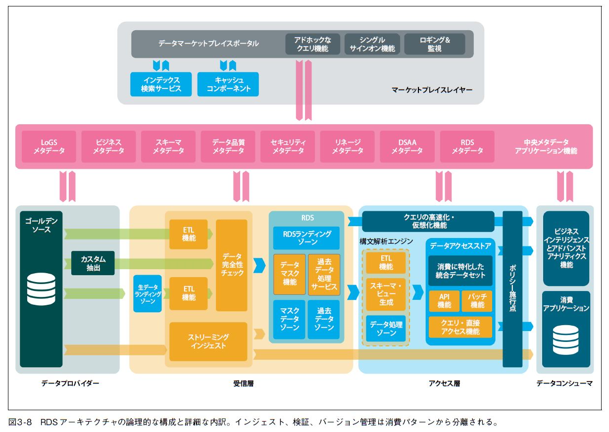

# まえがき

> (vii)「終業時のバッチ処理」という概念は、私にはパンチカードやメインフレームの時代の遺物のように感じました。

・[メモ] まだまだありそう

> (vii) LinkedIn のプロフィールの更新、ページ訪問、支払い、そのほかのイベントストリームを処理するために、スケーラブルなメッセージングや、ストレージ、処理を組み合わせたものがApache Kafka です。

・[メモ] LinkedInからKafkaが生まれた

# はじめに

> (x) 本書では、複雑で密に結合したデータランドスケープに陥らないようにする方法や、組織のDNAにアジリティやコントロールを組み込む方法を紹介します。

・[メモ] 組織にも踏み込む
★[疑問] データランドスケープとは？

> (x) 製品やベンダーついて言及する場合もありますが、全体的なビジョンはテクノロジーとは関係がないようにしています。

> (x) Scaled Architecture がほかのアーキテクチャと異なるのは、実用的に作成できるという点です。大規模な初期投資を行うことなく、少しずつ段階的に構築することができます。

・[メモ] 期待

> (xi) 読者について

・[メモ] ほぼ全員やん

# 1章 データ管理の崩壊

> (p.1) テクノロジーのトレンドにより、データランドスケープ（データの全体像）が分断されています。

・[メモ] データランドスケープの意味を理解

## 1.1 データ管理

> (p.2) データ管理のための行動や考え方は多岐にわたり、複数の領域にまたがります。ソフトウェアアーキテクチャ†2と密接に関連するものもあります。ソフトウェアアーキテクチャとは、ソフトウェアの設計と高レベルな構造のことです。

・[メモ] 別途書籍参照

> (p.2) データアーキテクチャはデータのマスタープランのことです。ブループリントや、参照アーキテクチャ、将来に対するビジョン、依存関係など、アーキテクチャの大局的な姿を考えることです。

・[メモ] まだよくわからん

> (p.3) データ統合と相互運用性には、あるコンテキストから別のコンテキストにデータを効率的に移動させることを目的に、データの移動や、収集、統合、結合、変換などを行うためのすべての考え方と行動が含まれます。

・[メモ] 重要そう

> (p.4) DAMA-DMBOKの中で、もっと多くの作業が必要であり、筆者がこの本を書くきっかけとなった領域は、データ統合と相互運用性です。

・[メモ] 重要らしい

> (p.4) 大規模なアーキテクチャの構築と管理には、メタデータの統合が重要です。しかし、メタデータの相互運用性（2 つ以上のシステムやコンポーネント間で、データを表現するデータを交換する能力）については十分に説明されていません。

・[メモ] 重要らしい

> (p.4) すべてのデータが一元化されて中央に保存されていても、下流でデータを消費する際にはコンテキストの切り替えが必要になるからです。

・[メモ] これに尽きる気がする

## 1.2 分析によるデータランドスケープの細分化

> (p.5) アドバンストアナリティクスとは、What-if 分析を行い、将来のトレンドや状態、イベントを予測し、隠れた関係や行動を検出し、意思決定を自動化することです。

・[メモ] これが破壊的トレンドの一つ。これにより中央集権化されたプラットフォームが失敗する。

> (p.6) アドバンストアナリティクスとデータベースが多様になり進化したことにより、データの急増とデータ集約という2 つの課題が生じています。

> (p.6) データが組織全体に散らばってしまうと、そのデータの元々の出所を見つけたり、品質を判断したりすることが難しくなります。

・[メモ] 一例として中央集権がRDBでソーシャル分析をする場合に別個のグラフデータベースにエクスポートする、など

> (p.6) 分析技術の発展は、データ集約の傾向を強めます。その結果、読み書きの比率が大きく変化してしまいます

・[メモ] 分析モデルが定期的に大量のデータを読み出す、など

> (p.6) 。このような多種多様な読み出しパターンに対応しながら、データを複製してコントロールを保つことは容易ではありません。

## 1.3 ソフトウェアの提供速度の変化

> (p.7) 開発チームは、データモデルを完全に把握していて、すべてのデータオブジェクトをまとめている（単一の）一意なデータストア、という設計から、データオブジェクトがあちこちに散らばるような設計に移行しなければなりません。

・[メモ] マイクロサービス化によるもの

## 1.4 ネットワークの高速化

> (p.7) 一般的に、これまでは、ネットワークの制約から、計算能力をデータに近づけるのがベストプラクティスでした。これからは、データのほうを移動して、計算能力に近づけることができます。ネットワークはもはやボトルネックではないのです。

・[メモ] コンピューティングをデータに近づけず（同じマシンに置かず）、ネットワークで疎結合にしてよいという意味か

> (p.8) コピー（複製）して、クラウドなどの他組織の計算能力に対してデータを移動するという、この分散パターンは、データのランドスケープをさらに細分化することになります。このため、データ管理戦略を明確化することが、これまで以上に重要になっています。

・[メモ] ますます管理が重要

## 1.5 プライバシーとセキュリティへの配慮は最優先

> (p.8) 法規制によって、大企業は、どのようなデータを収集したのか、どのようなデータを購入したのか、どのようなデータを組み合わせたのか、どのようにデータを分析したのか、どのようなデータを流通（販売）したのかについて透明性を確保しなければならなくなるでしょう。

> (p.9) データがどこから来たのか、データがどのように流通しているのかを把握することは非常に重要です。より強力な内部ガバナンスが求められます。

> (p.9) 組織内でのデータ管理のあり方について、これまでとは異なる、より防衛的な視点が必要になります。

## 1.6 運用システムと分析システムの統合の必要性

> (p.9) 運用分析は、既存の運用プロセスの予測と改善に焦点を当てており、トランザクションシステムと分析システムの両方と密接に連携します。分析によって、運用コンテキストに対するインサイトが得られるように、分析結果を運用システムに統合しなければなりません。

・[メモ] 分析データ（DWH）とトランザクションデータの統合が必要

> (p.9) このようなトレンドにより、運用システムと分析システムの両方を同時に結び付ける、これまでとは異なる統合アーキテクチャが必要となります。また、データ統合には、運用システムの速度と分析システムの速度という、異なる速度で動作する必要があります。

## 1.7 データ収益化に向けて、エコシステムを繋ぐアーキテクチャの必要性

> (p.9) 多くの人々は、自社を単一の独立したビジネスエコシステムと考えています。しかし、この考え方は変わりつつあります†8。

> (p.10) 。データを他社と共有したり、クラウドやSaaS のソリューションで利用したりすると、データは異なる場所に置かれることになり、統合やデータ管理が難しくなります。

## 1.8 企業を悩ます時代遅れのデータアーキテクチャ

### 1.8.1 エンタープライズデータウェアハウスとビジネスインテリジェンス

> (p.11) データの属性は、名前が同じでも意味や定義が異なるため、多くのバリエーションを作成するか、異なっていることや不整合を許容するかのどちらかになります。

> (p.11) 結局、コンテキストを統一しても、誰にとっても意味のないものになってしまう可能性があります。

> (p.12) 時間を待てなかったために生み出された創造性やショートカットによって、アーキテクチャはより複雑になり、インサイトを失ってしまうことになるでしょう。- 
・： 用者は悪い意味で創造的になる

### 1.8.2 データレイク

> (p.14) データウェアハウスは通常、RDBMを用いて設計されます。これに対して、データレイクは分散型データベースやNoSQLシステムを使うのが一般的です。

★[疑問] これって合ってる？？

> (p.14) しかし、生データの難しいところは、ユースケースごとに、常にデータを修正する必要があることです。データ品質についても考える必要があります。集約も行わなければなりません。データのコンテキストを整えるために、ほかのデータと組み合わせることもしなければなりません。何度も何度も作業を繰り返す必要があります。

### 1.8.3 中央集権化ビュー

> (p.15) データの専門家がビジネスドメインから排除されるために、創造性やビジネスインサイトが失われます。

☆[確認] ドメインの専門家が排除されるという意味かな

## 1.9 まとめ

### 1.9.1 Scaled Architecture

>p(.16) このように複雑にサイロ化したデータの問題を解決するのが、Scaled Architecture です。これはドメインベースの参照アーキテクチャです。

# 2章 Scaled Architectureの紹介：大規模なデータ管理

> (p.19) 筆者が対象としている大規模アーキテクチャは、データ管理とデータ統合を行うものです。これは企業向けのアーキテクチャです。

> (p.19) このアーキテクチャでも、アーキテクチャ構成要素を使います。アーキテクチャ構成要素とは、「ビジネスニーズを満たすために定義された機能のパッケージ」を意味するものです†1。

## 2.1 一般的な出発点

### 2.1.1 アプリケーションごとにアプリケーションデータベースを持つ

> (p.20) つまり、アプリケーションは何らかの形でデータを保存するので、アプリケーションデータストアが必ず存在することになります。

### 2.1.2 アプリケーションは特化したものであり、一意のコンテキストを持つ

> (p.20) 1 章では、アプリケーションは特定の問題を解決するために使用されると述べました。アプリケーションごとのデータは一意であり、ほかのアプリケーションのデータやコンテキストとは異なります。

### 2.1.3 ゴールデンソース

> (p.21) ゴールデンソースとは、権威あるアプリケーションです。このアプリケーションでは、すべての信頼できるデータが、ある特定のコンテキストで管理されています。1 つまたは複数のゴールデンデータセットで構成されます†3。

> (p.21) ゴールデンデータセットとは、生成された権威あるオリジナルデータのことです。このデータセットは真正かつ一意なものです。また、正確で、完全で、よく知られていなければなりません†4。ゴールデンデータセットは、データ要素（https://oreil.ly/RGKhT）で構成されています。データ要素とは、人間が読むことのできる情報の原子単位です。正確な意味やセマンティクスを持ちます。データ要素には識別可能な名前がついており、データガバナンスなど、ほかのデータ管理主体との接着剤の役割を果たします。

### 2.1.4 データ統合のジレンマからは逃れられない

> (p.21) アプリケーション間でデータを移動させる際には、データ作成時の一意のコンテキストがあるため、データ統合が必要となります。

> (p.21) あるコンテキストから別のコンテキストにデータを移す場合、常にデータ変換が必要になります。この点が、新しいアーキテクチャを常に形作ることになります。

### 2.1.5 アプリケーションがデータプロバイダーとデータコンシューマの役割を担う

> (p.22) データ提供アプリケーション（データプロバイダー）とは、データを作成し（データの出所）、データを提供するアプリケーションのこと。

> (p.22) データ消費アプリケーション（データコンシューマ）とは、ある特定の要件（商用目的、経営判断、リスクなど）に基づいて、データが保存／統合されるアプリケーションのこと。

> (p.22) データプロバイダーとデータコンシューマの役割は、外部パーティーにも適用されます。外部パーティーとは、企業のエコシステムの論理的境界外で動作するもののことです。一般的には、企業の管理下ではない、別のネットワーク上に存在しています。

☆[確認] SaaSなどのことかな？

## 2.2 理論的考察のポイント

> (p.23) アプリケーション間のデータ統合とは、複雑に絡み合うシステム間のデータ通信と相互運用性を管理することです。- 
・： し抽象的だな

> (p.23) アプリケーション統合は、ソフトウェアアーキテクチャやソフトウェア開発のレベルの話です。抽象的に言えば、企業のデータ統合とソフトウェア統合は互いに関係が深く、時には重なり合うこともあります

☆[確認] アプリケーション内の設計の話とアプリケーションをまたがるデータ統合のアーキテクチャが似ているということ？

### 2.2.1 オブジェクト指向プログラミングの原則
> (p.23) Robert C. Martin 氏の著書“Design Principles and Design Patterns”（objectmentor.com, 2000）には、データ統合に最適な設計原則が示されています。その設計原則の多くは、今日でも一般的な業務に適用されます。- 
・： ンクがあった（http://staff.cs.utu.fi/~jounsmed/doos_06/material/DesignPrinciplesAndPatterns.pdf）

> (p.23) 単一責任の原則、依存性逆転の原則、開放/閉鎖原則、安定依存の原則、安定抽象概念の原則

☆[確認] ここにまとまっている（https://blog1.mammb.com/entry/20090921/1253547322）。まあ本書としてはベースとなっている程度でもいいみたい。（たぶん）

### 2.2.2 ドメイン駆動設計

#### 2.2.2.1 コンテキスト境界

> (p.25) 多義的とは、視点や周囲の状況に応じて、コンテキスト境界の大きさや形状が変わるということです。つまり、コンテキスト境界を使用する際には、明示的に定義しなければならないということです。明示的に定義しておかないと、かなり曖昧なものになってしまいます。

> (p.25) ドメインは通常、複雑さを管理するために、サブドメインに分割されます。例えば、各サブドメインが組織のさまざまな部署に対応するようにします。

> (p.26) サブドメインは、コアサブドメイン、汎用サブドメイン、支援サブドメインなどに分類することができます。コアサブドメインは、最も重要なものです。コアサブドメインは、ビジネスを一意にする「秘伝のソース」となる部分です。汎用サブドメインは、ビジネスに特化したものではなく、一般的には既製品が簡単に利用できます。支援サブドメインは、競争上の優位性はありませんが、組織を維持するために必要なサブドメインです。通常、それほど複雑ではありません。- 
・： ブドメインはよくわからんね

> (p.26) ソフトウェアに論理的な境界線を設定することは、単一責任の原則に似ています。これは、一緒にまとめられるものは一緒にいるべき（そして効率的に管理されるべき）だという原則です。

> (p.26) 「伝統的な」グループ分けとドメイン駆動設計モデルの大きな違いは、ドメイン駆動設計では強制的に厳しい境界が設定されることです。コンテキスト境界は、独自に進化できますが、分離されなければならないと、Evans氏は主張します。このような分離は、通常、複雑なアプリケーションの内部機能を隠蔽したり（抽象化したり）、インタフェースやレイヤーがある程度安定になるようにすることで実現されます。これらの原則は、依存性逆転の原則や安定依存の原則に似ています。

#### 2.2.2.2 ユビキタス言語

> (p.26) 「ユビキタス言語とは、Eric Evans 氏がドメイン駆動設計で使用している用語です。開発者とユーザーの間で共通の厳密な定義（言葉）を構築することを意味します」とMartin Fowler 氏は述べています。このユビキタス言語は、特定の分野の人々が使用している定義、語彙、専門用語、学術用語と似たものです。

> (p.27) コンテキスト境界とユビキタス言語は深く関連しています。DDDでは、各コンテキスト境界が独自のユビキタス言語を持つことが想定されているためです。あるコンテキスト境界内で管理されているアプリケーションやアプリケーションコンポーネントは、すべて同じユビキタス言語を使うべきです。コンテキスト境界が大きくなり、チーム全体が同じ言葉を理解するのが困難な場合は、コンテキスト境界をより小さな部分に分割してください。コンテキスト境界が変われば、ユビキタス言語もそれに応じて異なるものになります。経験則では、1 つのコンテキスト境界は1 つのチーム（アジャイルまたはDevOps）で管理されます。同じチームのメンバーであれば、現在の状況とその依存関係のすべてを認識するのが容易だからです。

> (p.27) 同じように、1 章では、アプリケーションの設計とデータモデルは、そのアプリケーションが使われるドメインからコンテキストを受け取る、ということを説明しました。これらの設計手法はすべて強く結び付いています。

> (p.27) DDDを企業レベルのアプリケーションランドスケープに適用すると、ドメイン境界には、アプリケーションだけでなく、言語、知識、チームリソース、テクノロジーも含まれます。図2-3 に示すように、各コンテキスト境界には、独自のアプリケーション、データ、プロセス、コンテキストの定義（ユビキタス言語）が存在すると想定しています。

### 2.2.3 ビジネスアーキテクチャ

> (p.28) The Business Architecture Guild では、ビジネスアーキテクチャのことを「ケイパビリティ（機能）、エンドツーエンドの価値提供、情報、組織構造、およびこれらのビジネスビューと戦略、製品、ポリシー、イニシアチブ、ステークホルダーとの関係について、全体的かつ多次元的なビジネスビューを表すもの」と説明しています†12。

#### 2.2.3.1 ビジネスケイパビリティ

> (p.28) ビジネスケイパビリティは、ビジネスアーキテクチャ内で使われる構成要素のことです。Ulrich Homann氏が言うように、ビジネスケイパビリティとは、「特定の目的や結果を達成するために、ビジネスが所有または交換できる特定の能力のこと」です†14。ビジネスケイパビリティは、企業が戦略的なビジネス目標や目的を達成するために、ビジネスの現実を抽象化したものを提供します。ビジネスケイパビリティは、特定のコンテキストにおけるデータ、プロセス、組織、テクノロジーの関係をまとめて表したものです。

> (p.29) 。最上位の概念レベルでは、すべての戦略的ビジネス目標をビジネスケイパビリティにマッピングし、ビジネスケイパビリティとバリューストリームにまとめます†15。より具体的なアーキテクチャであるブループリントは、1 つ下のレベルのアプリケーションアーキテクチャで作成します。このブループリントでは、論理的な境界（解決方法の境界）を描くことができます。この境界がコンテキスト境界となります。

☆[確認] ここはさすがに良く分からんな

> (p.29) 境界やグラニュラリティ（粒度）をどう設定するかは、実際には科学的ではありません。それは芸術的なものです。そして、ヒューリスティックス（経験則）を伴うものです。

☆[確認] 実際にはビジネスアーキテクチャを使う以外にも様々なやり方がある。

> (p.30) ドメイン境界とは何か、どのようにしてコンテキスト境界を設定するのかを、よりよく理解したいのであれば、ドメインストーリーテリング（https://oreil.ly/Imivx）、イベントストーミング（https://oreil.ly/DH4OJ）、コンテキスト境界キャンバス（https://oreil.ly/cWXvT）をお勧めします。

> (p.30) ビジネスアーキテクチャにおけるビジネスケイパビリティは抽象的なままです。複数回、実装することができます。インスタンス化されたものはケイパビリティインスタンスと呼ばれます。

> (p.30) 例えば、CRM（顧客関係管理）は、企業の小売部門とコーポレートビジネス部門の両方にビジネスケイパビリティとして実装することができます。また、同じビジネスケイパビリティをサービスモデルとして中央で実装し、複数の部門に提供することもできます。分散するか、集中管理するかは、単に選択の問題です。例えば、セキュリティやコンプライアンスなどの管理が必要な場合には、CRMを中央集権的に導入することが望ましいでしょう。また、チームの力関係が異なっていたり、利害が対立していたりする場合には、CRMを各部門に導入する方が望ましいでしょう。

☆[確認] この例はわかりやすかったかも。

> (p.31) 例えば、オンライン決済サービスを考えてみましょう。最初は社内で開発され、後にPayPalにアウトソーシングされる場合もあります。このような組織上の変更が、ビジネスケイパビリティに影響を与えるべきではありません。企業の目標を達成するためにオンライン決済を行う、という機能にはなにも変わりがないからです。

☆[確認] この例も分かりやすい

#### 2.2.3.2 ビジネスケイパビリティとアプリケーションの関連付け

> (p.31) ビジネスケイパビリティは、組織が行うことを表し、問題空間を対象とします。ビジネスケイパビリティが実装されると、特定のコンテキストに対して具現化したもの、つまり、ケイパビリティインスタンスが作成されます。この解決空間の境界内では、複数のアプリケーションやコンポーネントが連携して、特定のビジネス価値を提供します。ある特定のビジネスケイパビリティ用のアプリケーションやコンポーネントは、ほかのビジネスケイパビリティ用のアプリケーションからは分離されます。

☆[確認] 図2-4がすべて

> (p.32) まとめると、アプリケーションとは何かについての答えは、読者がどのような立場でアプリケーションについて考えるかで大きく変わります。

> (p.32) この2 つの異なる視点を組み合わせることで、多くの価値が生まれます。アプリケーションレベルでは、ビジネスケイパビリティ、プロダクト所有者、DevOpsチーム、プロジェクトなどを結び付けることができます。アプリケーションコンポーネントレベルでは、IT 製品、バージョン、構成アイテム†16、契約、保守計画などを結び付けることができます。

> (p.33) 例えば、ある特定のビジネスケイパビリティのコンテキストで作成されたすべてのデータは、ある特定のプロダクト所有者に属すると決めることができます。プロダクト所有権とデータ所有権の整合性が非常に高まります。

> (p.33) ビジネスケイパビリティとそのインスタンスをコンテキスト境界にマッピングし、ブループリントを生成すると、複数のアプリケーションが同じビジネスニーズを満たすために連携することができます。

> (p.33) CRMの戦略目標を達成するために、3 つのアプリケーションが密接に連携していることがわかります。これらのアプリケーションの周囲や内部には、適用可能性やスコープ、責任などの具体的な境界線を引きます。ドメイン解決空間の論理的な境界内にあるアプリケーションやアプリケーションコンポーネントは、同じユビキタス言語を共有し、直接通信することができます。これらは緊密に結合されるべきです。しかし、コンテキスト境界を越えると、ドメインが異なるので、注意が必要です。アプリケーションランドスケープにおいて、柔軟性を維持するには、分離することが必要です。

> (p.33) あるビジネスケイパビリティをインスタンス化したアプリケーションや、データ、プロセスは、別のビジネスケイパビリティをインスタンス化したアプリケーションと直接やり取りしてはなりません。

#### 2.2.3.3 ビジネスアーキテクチャの実践：ケーススタディ

> (p.34) コンテキスト境界は、インタフェースや抽象化レイヤーを介して相互に通信します。あるコンテキスト境界からデータが提供される場合、通信には、そのコンテキスト境界のユビキタス言語が使用されます。つまり、「顧客管理」コンテキスト境界内のシステムが通信する際には、「顧客管理」ユビキタス言語が通信用の言語として使用されます。このモデルでは、データコンシューマがデータを自分のコンテキストに変換しなければなりません。

☆[確認] コンシューマ側自身でそのコンテキスト境界内のユビキタス言語に変換する？

#### 2.2.3.4 ビジネスアーキテクチャパターン

> (p.35) この例では、異なるドメインのアプリケーション同士が直接通信しています。このパターンは、ポイントツーポイント統合とも呼ばれています。

☆[確認] NGな例という理解？

## 2.3 通信と統合のパターン

### 2.3.1 ポイントツーポイント

> (p.36) 1 つ目のパターンは、あるアプリケーションから別のアプリケーションへ、直接通信を行うポイントツーポイント通信です。ポイントツーポイント通信は、アプリケーション間を密結合にします。このような統合形態は、図2-6 に示すように、すぐに複雑化してカオスになってしまいます。

### 2.3.2 サイロ型

> (p.36) ポイントツーポイント通信の代わりに、すべてのデータとアプリケーションロジックをまとめてサイロを作るという方法があります。サイロには、すべてのデータを迅速に入手できるという利点がありますが、大企業の規模では、データ流通にサイロを使うとアジリティが得られません。

### 2.3.3 ハブスポークモデル

> (p.37) データをまとめるハブスポークというアプローチは、概念的にはサイロに似ています。しかし、ハブスポークモデルでは、データをほかのデータと統合しない点が大きく異なります。

☆[確認] 本当にサイロにならない？

## 2.4 Scaled Architecture

> (p.38) 企業が必要としているのは、データプロバイダーとデータコンシューマを簡単に接続し、柔軟性、コントロール、インサイトを提供できる、スケーラブルで高度な分散型アーキテクチャです。このアーキテクチャをScaled Architecture と呼びます。

> (p.38) エンタープライズデータ管理・統合アーキテクチャを運用するには、パターンを標準化し、明確な設計原則に基づいて作業を行い、厳格に選択を行う必要があります。以降の項では、設計上の基本的な選択から始めて、重要なパターンや原則を少しずつ説明していきます。

### 2.4.1 ゴールデンソースとドメインデータストア

> (p.38) Scaled Architecture の最初の原則は、「ゴールデンソースシステムからのゴールデンデータセットの流通のみを許可する」というものです。ゴールデンソースとは、ある特定のコンテキスト境界において、すべての真正なデータを作成するアプリケーションのことです。

> (p.39)
> 原則1：変更はゴールデンソースでしか行われない：ゴールデンデータセットとその要素の変更は、所有者の承認を得て、ドメイン内のゴールデンソースでのみ行うことができます。
> 原則2：ゴールデンデータセットだけを提供する：ゴールデンソースシステムからは、生成されたデータ（ゴールデンデータセット）のみを配信することができます。
> 原則3：ゴールデンデータセットはアプリケーションのサブセットである：ゴールデンデータセットは、あるアプリケーション内で生まれるため、複数のアプリケーションにまたがることはできません。
> 原則4：ゴールデンデータセットと要素は、検索性を高めるために中央に登録される：透明性と信頼性を提供するためには、ゴールデンソースと所有権メタデータ（データに関するデータ）を、ツールやプラットフォームを通じて中央で利用できるようにすることが重要です。そのためには、すべてのドメインが一意のゴールデンデータセットと要素を中央で管理されるように登録し、自らが生成し公開するデータと関係付ける必要があります。

> (p.39) ドメインデータストア（DDS、domain data store）について紹介します。DDSはゴールデンソースシステムとは異なります。ほかのシステムからデータのコンテキストを消費し、統合し、変更するためのものです。このようなデータ（図2-8）は、DDSのコンテキスト境界の外部にある、別の場所で生成されたものです。

> (p.40) DDSが新しいゴールデンデータセットを作成すると、それが新しいゴールデンソースになることがあります。この場合、データはまったく新しいコンテキストを持ち、新しい事実が生まれます。また、新しい所有権が生じます。このことを踏まえると、次のような3 つの原則が生じます。
> 原則5：新しいデータは新しい所有権を生む：データが変更され、新しい事実が作成されると、新しい所有権が発生します。フィルタリング、統合、結合、大文字と小文字の変換、フィールド名の変更、集約などの単純な「構文変換」では、事実が変わらないため、新しい所有権は生まれません。
> 原則6：受け取ったゴールデンデータセットを転送することは許されない：データコンシューマが入手したゴールデンデータセットは、データ所有者やデータセキュリティチームの承認なしに、ほかのドメインに流通させることはできません。
> 原則7：必要のないDDS は作成しない：ゴールデンデータセットを、管理されていない状態でコピーすることは、管理コストが高くなり、コントロールが難しくなるため、避けるべきです。データ統合は複雑です。ユーザーは、抽出したデータやデータのコピーが必要でないならば、保持しつづけてはなりません。アプリケーションからデータを抽出し、データコンシューマ側に保存することは、新たに作成されたデータを保存する必要がある場合のみにしてください。

☆[確認] 原則6とかは個人的に重要そうだと感じる。複数経路をもつことは許されない。

> (p.40) ここで重要なのは、DDSはデータコンシューマとデータプロバイダーの役割を同時に行えるということです。

### 2.4.2 データ配信契約とデータ共有合意

> (p.41) データプロバイダーとデータコンシューマは、データの消費方法や、統合方法、流通方法について契約を結ぶ必要があります。
> 原則8：データ流通と消費は、契約や合意によって守られる：データの提供と消費に関する説明責任とデータガバナンスについては、データ配信契約とデータ共有合意によって守られます。

> (p.41) この契約は、インタフェースの互換性を保証し、サービス条件とサービスレベルアグリーメント（SLA）が含まれます。

> (p.41) データ配信契約の利点は、アプリケーション間の結合度合いや依存関係の数を把握できることです。また、契約をテストすることで、アプリケーションやインタフェースを変更した場合に、データコンシューマの要件を満たしているかを確認できます†19。

> (p.41) データ共有合意は、データ配信契約とは対照的に、使用方法や、プライバシー、目的（制限を含む）を対象としています。これらはインタフェースとは独立したもので、どのようなデータがどのような目的のために使われるかを示しています。データコンシューマは、さまざまなユースケースにおける、データ利用の目的を登録・公開し、データを再流通しないことに同意する必要があります。この点は重要です。法規制の観点からだけではありません。データプロバイダーに貴重な情報を提供するからです。

> (p.41) これらの契約は、中央リポジトリに保存されなければなりません。この中央リポジトリは、新しいアーキテクチャにおいて正式な構成要素となります。これらの契約を中央で発行することで、データプロバイダーとデータコンシューマは、中央チームのサポートを受けずに、データ配信とデータ消費に関する問題を自分たちで解決することができます。

☆[確認] 重要なポイント

### 2.4.3 サイロ化の解消

> (p.42) データウェアハウスモデルでは、すべてのデータを統合する際に、コンテキスト境界がしばしば衝突するため、不整合に対処しなければなりませんでした。また、データウェアハウスモデルでは、データプロバイダーとデータコンシューマが密結合しているため、依存関係の管理が非常に難しくなります。多くの場合で、データ品質の問題、修正、不整合のために、データサイロを信頼できなくなります。

★[疑問] DWHは非推奨？

### 2.4.4 エンタープライズ規模でのドメイン駆動設計

> (p.43) コンテキスト境界が決定したら、そのコンテキスト境界は分離されなければなりません。ほかのコンテキスト境界と通信する場合は、必ずデータレイヤーを通して行わなければなりません。

> (p.43) DDDモデルでは、データ管理の中でどのようにグループを見つけて、コンテキスト境界を決定するかについては明示されていません。そのため、筆者は新しいアーキテクチャの設計原則に、次の項目を追加します。
> 原則9：データはドメイン全体で管理・流通される：データ品質、データパイプライン、データが読み出せることは、ドメインの関心事です。そのデータについて熟知しているはずの人々が、データの管理に責任を持ちます。データ所有権モデルは、中央管理ではなく分散管理とします。
> 原則10：コンテキスト境界はインスタンス化されたビジネスケイパビリティに関係付けられる：コンテキスト境界は、ケイパビリティインスタンスまたはその一部を実装します。つまり、コンテキスト境界は、その実装を表すものです。そのため、コンテキスト境界は同じ解決空間に焦点を合わせます。
> 原則11：コンテキスト境界は、1 つまたは複数のアプリケーションに関連付けることができる：コンテキスト境界は、1 つのアプリケーションで構成されても、複数のアプリケーションで構成されてもかまいません。複数のアプリケーションで構成する場合、すべてのアプリケーションは、あるバリューストリームにおいて同一の（ビジネス）ケイパビリティインスタンスに対して、価値を提供することになります。
> 原則12：ユビキタス言語は、コンテキスト境界の中で共有される：自身のコンテキスト境界内で、データを流通するアプリケーションやアプリケーションコンポーネントは、同一のユビキタス言語を使います。同じ用語や定義が別の意味で使われることはありません。それぞれのコンテキスト境界は、概念データモデルと1 対1 の関係になります。
> 原則13：コンテキスト境界は、インフラストラクチャー、ネットワーク、組織から独立する：アプリケーション機能、プロセス、データを踏まえて、どのようにまとめるかを考えてください。データ管理の観点で言えば、コンテキスト境界をどう作るかについては、インフラストラクチャーや、ネットワーク、組織は関係ありません。
> 原則14：1 つのコンテキスト境界は、1 つのチームに属する：理想的には、それぞれのコンテキスト境界は、1 つのアジャイルチームまたはDevOpsチームに属します。1 つのチームにしか属していないのであれば、結合点をどうするかは管理しやすくなり、チームメンバー全員が簡単に理解できるからです。
> 原則15：境界線は厳密にする：コンテキスト境界の境界線は厳密にしてください。コンテキスト境界はそれぞれ区別してください。一括りで考えるべきビジネス上の関心や、プロセス、データは、一括りにして、コンテキスト境界内で維持・管理するようにしてください。
> 原則16：境界を越えるときは分離する：コンテキスト境界内では、密結合できます。しかし、境界線を越えるときには、インタフェースを分離してください。
> 原則17：境界内であれば、どんな形式でも問題ない：明示的な境界線を守っているのであれば、あるコンテキスト境界でのデータ形式はどのようなものでもかまいません。
> 原則18：仮想化と調和は、コンテキスト境界の中でのみ許される：データの仮想化やデータの調和は、レイヤーを追加・作成することと同じように許されます。ただし、それはコンテキスト境界の境界内に限られます。
> 原則19：データは、付加システムや中間システムを介して配信されるべきではない：ゴールデンソースシステムを難読化する付加システムを使うと、複雑さが増大し、データとその品質が変化し、データのリネージをたどってデータの出所を調べることが難しくなります。データの受け渡しに付加システムや中間システムを使用することは推奨されません。
> 原則20：データレイヤーはドメインロジックを含むべきではない：ドメインロジックや複雑な統合は、コンテキスト境界内にとどめるべきです。統合コンポーネントに含めてはなりません。こうすることで、隠蔽されたドメインロジックによって、ほかのドメインとの対話を邪魔されるという不安を抱えることなく、ドメインは価値を提供することに集中できます。

☆[確認] 図2-4を見ながらギリギリ理解できるかどうかという感じ→嘘です、原則9～20は急に説明が無さ過ぎる。

#### 2.4.4.1 単一ステップの変換

> (p.45) DDDモデルでは、コンテキスト変換は、単一ステップの変換で直接実行されます。データはあるコンテキストから別のコンテキストへと直接移動します。このように単一ステップで変換が行われることからわかるように、データプロバイダーとデータコンシューマは、企業における単一のカノニカルモデル（正規モデル）や語彙を共有していません。コンテキスト境界は、境界ごとに、独自のユビキタス言語を使用してデータを提供します。

> (p.45) 企業レベルのカノニカルモデルを持たなくなることで、定義間の不整合や、信頼できる情報に複数のバージョンが存在することを避けることができます。

★[疑問] 本当かな？バージョンは配信契約の図2-10中でもある。バージョンがシンプルになるのはYESな気はするが。
★[疑問] そういえば後方互換性は保証するのかな。

> (p.45) このモデルの欠点は、チームがデータを消費する際に、さまざまなコンテキストを理解しなければならないことです。エンタープライズモデルの単一の語彙を学ぶのではなく、多くの異なるコンテキストを解釈しなければなりません。これには、ドメインがほかのドメインにデータを提供する方法を規定する強力な原則が必要です。データは簡単に消費できなければなりません。また、データ統合ができる状態でなければなりません。

・[メモ] 自由に配信して良いというわけではなさそう

### 2.4.5 読み出しに最適化されたデータ

> (p.46) データ統合の苦しみを和らげるためには、あるコンテキスト境界から別のコンテキストに対して、データをどのように公開・提示するかについて、いくつかの原則を設定する必要があります。

・[メモ] 原則が多すぎる…

> (p.46)
> 原則21：アプリケーションの技術的な情報を隠す：この原則は、依存性逆転の原則（p.23「2.2.1 　オブジェクト指向プログラミングの原則」参照）とよく似ています。データをほかのデータコンシューマに提供する際に、データ内部の構造を抽象化することが求められるため、データの提供方法に影響します。
> 原則22：集中的なデータ消費に最適化する：多くのアプリケーションは、大量のデータを消費するようには最適化されていません。ドメインが簡単にデータを消費できるようにするということは、親と子の構造が延々と続く高度に正規化されたデータを、ほかのドメインに提供することではありません。データは正規化しすぎず、直感的にグループ化されるべきです。ユーザーフレンドリーなフィールド名をつければ、データコンシューマ側で検索しやすくなります。
> 原則23：ユビキタス言語は、通信のための言語である：データプロバイダーとして機能するコンテキスト境界は、それぞれ独自のユビキタス言語を使ってデータを公開する必要があります。つまり、データプロバイダーは、ほかのドメインのビジネスロジックを自分のドメインに組み込むべきではありません。
> 原則24：インタフェースには一定の成熟度と安定性が求められる：この原則は、変化のペースを抽象化するためのものです。例えば、ドメインの扱う範囲が頻繁に変更される場合、その変化を抽象化して安定的なものにすることが求められます。また、スキーマも、ある程度安定した互換性を提供しなければなりません。
> 原則25：データはすべてのパターンで一貫しているべきである：この原則は、さまざまなパターンでデータを公開する際に、その公開方法については一貫性を持つべきというものです。例えば、顧客住所というフィールドは、同じデータがさまざまな方法で公開される場合でも、すべてのパターンで一貫性がなければなりません。

### 2.4.6 全体像としてのデータレイヤー

> (p.48) これまで説明したように、データ変換が常に必要となるため、データ変換を容易にすると同時に、ポイントツーポイントの複雑さを軽減し、サイロ型を回避できるような新しいモデルが必要です。これを実現するのがデータレイヤーです。

> (p.48) データレイヤーを使うアプローチは、ハブスポークモデルに似ています。これは、すべてのデータが、データレイヤーという同じ論理的な場所を流れるようにするからです。

> (p.49) 次の項で紹介する3 つのアーキテクチャは、完全にメタデータ駆動型です。ほかのデータ消費アプリケーションで、再利用可能なデータサービスを定義するのに役立ちます。また、メタデータは、流通のリネージや、消費要件、データの品質、意味などについての情報も提供します。このメタデータをAPI経由で公開することで、データプロバイダーとデータコンシューマは、さまざまなアーキテクチャとの相互運用性が高まり、データパイプラインの自動化を実現できるようになります。

#### 2.4.6.1 読み出し専用データストアアーキテクチャ

> (p.50) 最初のアーキテクチャは、RDS（Read-Only Data Store、読み出し専用データストア）アーキテクチャです。このRDSアーキテクチャでは、データプロバイダーが、さまざまな種類の読み出し専用データストアを介して、データにアクセスできるようにします。

#### 2.4.6.2 APIアーキテクチャ

> (p.50) APIアーキテクチャは、リアルタイムや低遅延のユースケースにおいて、サービスを接続し、少量のデータを流通するために使用されます。RDSアーキテクチャは読み出しを容易にします。これに対し、API アーキテクチャは、書き込み、更新、削除処理を容易にします。

#### 2.4.6.3 ストリーミングアーキテクチャ

> (p.50) ストリーミングアーキテクチャは、リアルタイムで大容量のイベントやメッセージのストリーミングに重点を置きます。ストリーミングがAPIと異なるのは、非同期であること、高いスループットを重視すること、そしてアプリケーションの状態をコピーするためにも使用できることです。

### 2.4.7 メタデータとターゲット運用モデル

> (p.51) メタデータにより、Scaled Architecture を連合型で実装できます。統合機能を中央で提供するのではなく、アーキテクチャの一部や統合機能をドメインやチームが自ら構築・実行できるようにすることで、ターゲット運用モデルを変更することができます。

> (p.52) ブループリントに機械学習を適用して、理想的なドメイン構造を見つけ、アーキテクチャを最適化することもできます。さまざまなドメイン間で激しい通信が行われている場合は、コンテキスト境界が間違っていることがわかります。サービス間の集中的なデータ交換は、一般的に、それらのサービスが実際には単一のサービスであるべきことを意味します。

☆[確認] まあこれは分かりやすい

## 2.5 まとめ

> (p.53) このような中央機能を構築するためには、個々のチームが統合パターンやツールに関する決定権を放棄する必要があります。

☆[確認] どの部分の決定権を放棄すべきなのかまだ分からないな。

# 3章 膨大な量のデータの管理：読み出し専用データストアアーキテクチャ

> (p.55) RDSアーキテクチャ
> (p.55) CQRS（Command and Query Responsibility Segregation、コマンドクエリ責務分離）のパターンを検証

## 3.1 RDSアーキテクチャの紹介

> (p.55) Scaled ArchitectureのRDSには、データウェアハウスとの技術的な共通点があります。例えば、従来型のオフラインバッチ処理は、データウェアハウスのエンジニアには馴染みのあるデータ流通方法です。一方、RDSは従来のデータウェアハウスとは大きく異なる部分があります。RDSはドメイン言語を継承し、不変です。また、より多くのデータを管理することができ、ほかのインジェストパターンも持ちます。アドバンストアナリティクスやビジアドバンスドアナリティクスやビジネスインテリジェンスなどのデータ集約型のプロセスに最適化されています。

## 3.2 コマンドクエリ責務分離

### 3.2.1 CQRSとは

> (p.56) 操作コマンドと分析クエリ（よく、書き込みと読み出しと呼ばれます）はまったく異なる操作です。CQRSパターンは、コマンドとクエリを別々に扱います（図3-1）。負荷の高いシステムを調べてみると、コマンド側でほとんどの計算機リソースが使用されていることがわかります。

> (p.57) 最適化のため、CQRSでは2 つのモデルを用いて書き込み（コマンド）と読み出し（クエリ）を分離しています。分離した後は、両者を同期させる必要があります。これは通常、変更時にイベントを発行することで行います。図3-1 では、「イベントの矢印」で示してい
ます。

> (p.57) 読み出しを非常に高速に実行する必要がある場合や、異なるデータ構造が必要な場合は、ACID（不可分性、一貫性、独立性、永続性）のデータベース特性は維持しながら、別のテクノロジーを選択することができます。

★[疑問] 現実的には何かを犠牲にしていると思うが…

> (p.58) CQRSはマテリアライズドビューと深く関連があります†2。データベース内のマテリアライズドビューは、基盤となるテーブルによって継続的に更新される、データの物理的なコピーです。マテリアライズドビューは、パフォーマンスの最適化のためによく使われます。

☆[確認] 初めてマテリアライズドビューを理解した。

### 3.2.2 大規模CQRS

> (p.58) RDSは、データの複製を担当し、データプロバイダーとデータコンシューマの間のデータレイヤーに位置付けられます。RDSは高度に管理され、ドメインからそのコンテキストを継承します。簡単にいえば、データプロバイダーとデータコンシューマが大量のデータを交換したいときには、まず、読み出し専用のデータストア（図3-2 参照）が作成される、ということです。

> (p.59) RDSはデータプロバイダーに近い左側に配置されており、変換ステップはデータコンシューマに近い右側に配置されていることに注意してください。

> (p.59) RDSは不変なデータベースであるため、読み出し専用となります。なぜ不変なのでしょうか。不変なデータからは、同じデータを何度も再生成することができるからです。読み出し専用のデータベースを使用すれば、同じドメインのデータに対して、信頼できる情報が複数存在することはありません。この原則に従うRDSは、新しいデータを作らないからです。信頼できる情報は、ゴールデンソースのアプリケーションでのみ修正することができます。

★[疑問] 不変とは？コンシューマ側で変えれないということ？たぶんそうよね…

> (p.59) RDSには、権威あるオリジナルのゴールデンデータセットのみ配信できます。一意のデータを使用することで、データアクセスとデータ管理の両方において、信頼できる情報のソースが1 つになります。これは、p.38「2.4.1 　ゴールデンソースとドメインデータストア」で説明したことと一致しています。

★[疑問] 「権威ある」の意味がまだピンとこないんよね

> (p.59) データプロバイダーのコンテキストがRDSの設計を決定します。ドメイン駆動設計の理念に基づき、モデルはデータプロバイダー（コンテキスト境界）から継承され、そしてビジネスに基づいたものになっています。エンタープライズモデルは使われません。

★[疑問] エンタープライズモデルとは？

> (p.60) RDSはアプリケーション専用であるため、隔離されており、ほかのアプリケーションと直接共有したり、依存関係を持ったりすることはできません。この原則は、前の3 つの原則と同じように、p.43「2.4.4 　エンタープライズ規模でのドメイン駆動設計」で説明した内容（境界は厳格にしなければならない）を基に組み立てられています。

> (p.60) データプロバイダーに属するRDS内には、データコンシューマのビジネスロジックや統合ロジックを配置することはできません。ドメイン固有のビジネスロジックは、ドメイン境界内にとどまらなければなりません。境界を越えてはなりません。RDSは、データプロバイダーの一部であると同時に境界でもあると考えられます。これらの関心事を分離することで、アジリティを最大限にします。

★[確認] 「ドメイン固有のビジネスロジックは、ドメイン境界内にとどまらなければなりません」てのは大事そう

> (p.60) データコンシューマは、RDSに直接新しいデータを作成することはできません。データコンシューマはデータプロバイダーになることができますが、その場合は、RDSをホストするプラットフォームからデータをエクスポートする必要があります。特に共有プラットフォームでは、データコンシューマは、データを新しいRDSに渡す前に、まずデータコンシューマのプラットフォームにデータを転送しなければなりません。そうしないと、大量のデータや、無限のレイヤー、データスプロールが発生する危険性があります。

★[疑問] 新しいデータを作れないことはわかるけど、後半は何言ってるか分からない。

> (p.60) データの構造を抽象化する必要があるため、その背後にあるデータソースは隠蔽されます。この原則と次の原則は、p.46「2.4.5 　読み出しに最適化されたデータ」の内容と一致しています。

> (p.60) RDSは汎用的なデータ消費に最適化されている必要があり、アプリケーションデータのサブセットを含む場合があります。これについては6 章で詳しく説明しますが、コンテキストは同じでなければなりませんが、データ構造は同じである必要はありません。

★[疑問] サブセットとは？？

> (p.60) 各アプリケーションやシステムは、少なくとも1つのRDSインスタンスを持ちます。最初のインスタンスは、ゴールデンソースアプリケーションの近くに配置されます。例えば、同じオンプレミスや、クラウドインフラストラクチャーの中に配置されます。

★[疑問] ここでいうインスタンスとは？？ゴールデンソースは本当のDBのことっぽいな。でRDSインスタンスはレプリカのことかな。

> (p.60) データプロバイダーは、データ品質、設計、RDSへの配信に責任を負います。

> (p.60) データコンシューマにより、コンテキスト変換ステップが常に必要となります。新しいアーキテクチャは、すべてのデータ変換とデータ移動に対して必要な情報を与えてくれるので、この変換を容易にしてくれます。このため、変換ステップは、図3-3 に示すように、データレイヤーの傘下に置かれます。

☆[確認] 変換はコンシューマ側がやる

> (p.61) ここまで見てきたように、この方法は多くのデータウェアハウスやデータレイクの実装とは異なります。中央プラットフォームと機能は提供されますが、データはドメインコンテキスト中に残ったままです。エンタープライズモデルや異なるフォーマットに変換されることはありません。また、生データはソースシステムの正確なコピーではありません。データは、素早く、簡単に消費できるように、そして再利用できるように最適化されます。なお、これらの点の多くは、6 章でより深く説明します。

> (p.61) データが異なるコンテキストに変換されると、新しいデータが作成され、新たな所有権が発生します。そのため、ゴールデンソースや、RDS、DDSなどの消費アプリケーションは、明確に分離されます。

★[疑問] DDSとは？

> > (p.39) ドメインデータストア（DDS、domain data store）について紹介します。DDSはゴールデンソースシステムとは異なります。ほかのシステムからデータのコンテキストを消費し、統合し、変更するためのものです。このようなデータ（図2-8）は、DDSのコンテキスト境界の外部にある、別の場所で生成されたものです。

> (p.61) Scaled Architecture では、複数のRDSを組み合わせて、互いのデータを複製することができます。例えば、あるデータコンシューマが、複数のRDSのデータを使用し、組み合わせてもかまいません。また、RDSを、ほかのRDSに複製してもかまいません。

## 3.3 読み出し専用データストアのコンポーネントとサービス

> (p.62) すべてのドメインが独自のRDSをホストし、独自のテクノロジースタックを選択できるような連合型のアプローチでは、製品や、インタフェースプロトコル、メタデータ情報などがばらばらになってしまいます。

☆[確認] RDS自体を統合する

> (p.63) 単一のサイロを作りましょうと言っているのではありません。複数のセルフサービスプラットフォームが、同じインフラストラクチャーを共有するようにしてはどうかと言っています。

> (p.63) RDSには、バケット、フォルダ、高性能データベース、仮想化インスタンスなど、さまざまな形状や形態があります。これらはすべて、選択した基盤テクノロジーとユースケースの要件によって決まります。

### 3.3.1 メタデータ

> (p.64) 共有プラットフォームが正しく設計されていれば、インタフェースのパフォーマンス指標や、データ品質、データに適用されるリネージと変換ロジック、インタフェースのスキーマデータなどを自動的に抽出することができます。

☆[確認] ちょっと抽象的でわからんなぁ。とりあえず「エンタープライズメタデータ機能群」ってのが大事なのかな？

> (p.65) メタデータが収集されつづけている限り、データアーキテクチャ全体のインサイトを失うことはありません。これらの点については、10 章で再び説明します。

### 3.3.2 データ品質

> (p.65) データセットがRDSに読み込まれると、データ品質ルールを用いて、ある特定のメトリクスで検証されます。まず、データの完全性を検証し、公開されたスキーマに対してデータを技術的に検証できるかどうかを確認します。次に、データの網羅性、正確性、一貫性、妥当性など、機能面でのデータ品質メトリクスを検証します。

> (p.65) RDSに対して共通インフラストラクチャーを利用するメリットは、ビッグデータの力をデータ品質処理に活用できることです。

☆[確認] 本書では、Apache Sparkによる処理、データ品質メトリクスを計算するためのオープンソースツールDeequ、DataBricksが開発したDelta Lakeはスキーマとデータの両方の検証に使用可能。

> (p.66) データ品質の管理には、ソースでの管理とRDSでの管理の2 つの方法があります。RDSでデータ品質を管理する利点は、同一プラットフォーム上の複数のデータソースを使って、参照整合性のクロスチェックもできることです。ソースシステムでは、ほかのアプリケーションやシステムのデータを参照することがよくあります。参照整合性をクロスチェックし、すべてのRDSのすべてのデータセットを比較対照することで、存在さえ知らなかったエラーや相関関係を見つけることができます。

☆[確認] RDSで品質を管理するメリット

### 3.3.3 RDSの階層

> (p.67) さまざまな消費パターンに対応するために、RDSを「受信層」と「アクセス層」の2 つの層に分けて考えることをお勧めします。

> (p.67) 受信層は通常、低コストの（オブジェクト）ストレージをベースにします。受信データセットの品質の検証、メタデータのプロファイリング、過去データセットのアーカイブと構築を行います（これらのアプリケーション機能については後ほど説明します）。おわかりのように、受信層は最終的に大量のデータを保持することになります。一般的には、CSV ファイルやJSON ファイルの集合となります。また、データはさまざまな方法で受信層にインジェストすることができます。オフラインのバッチ処理、イベント駆動型、APIベース型、変更データキャプチャなどです。

> (p.67) 、データアクセス層は読み出し用に最適化されています。ユーザーエクスペリエンスの向上や性能改善のために、いくつかのクエリ機能を提供します。データは依然としてドメインコンテキストの中にありますが、ビジネス上の問題には、より適切に対処できます。明らかに、この層はより高価なものになります。さまざまな消費パターンのユースケースに対応する必要があるため、複数のデータアクセス層が存在することもあります。例えば、高速処理のためには、データセットをキーバリューストアやインメモリデータベースに格納したり、テキストのクエリのためには、検索に最適化されたデータストアに格納したりします。また、データを分析に適した形に加工することもできます。過去データや、受信層のデータのサブセットのみを使用して、集計や、フィルタリング、処理を行うことができます。

### 3.3.4 データインジェスト

> (p.69) アプリケーションデータをゴールデンソースからRDSに移動させるには、2 つの異なるインジェスト方法を検討する必要があります。

> (p.69) 1 つ目は、イベント駆動型処理またはイベント駆動型データです。データを小さなイベントまたはデータセットのストリームとして転送する処理のことです。

☆[確認] ここは良くある話かな

> (p.69) 2 つ目のインジェスト方法は、バッチ処理です。大規模な決済システムから1 日の終わりにすべてのトランザクションを受け取るなど、大量のデータを一度に転送するプロセスのことです。バッチは通常、数百万のレコードを含むデータセットをファイルとして保存します。

#### 3.3.4.1 スキーマメタデータ

> (p.69) 旧来のシステムをバッチ処理する場合、一般的に弱点となるのがスキーマメタデータ管理です。TXTやCSV（comma-separated values）ファイルのデータの完全性と網羅性のために、CSVファイルのヘッダーとしてスキーマを表すメタデータを追加して、フッターとして行数を表すメタデータを付加することを検討するとよいでしょう。

> (p.71) メタデータが利用できなければ、多くのパイプラインを手作業で作ることになります†7。メタデータがあれば、自動化することも、アーキテクチャに検証チェックポイントを組み込む方法も開発できます。また、どのようなテクノロジーを基盤として使用しても一貫して機能します。

### 3.3.5 市販ソリューションの統合

> (p.71) 市販製品（COTS、Commercial Off-the-Shelf）からのデータの統合と収集には、さらに注意が必要です。多くの製品は、解釈やアクセスが非常に困難です。データベーススキーマは非常に複雑であることが多く、参照整合性は通常、データベースではなく、アプリケーションを通じてプログラム的に保守されているからです。

> (p.71) どのような状況でも、まず別の場所ににデータをダンプできるような追加サービスを提供することをお勧めします（図3-9）。この場所から、RDSへのデータパイプラインを開発することができます。

★[疑問] 現実問題できるとは思えないな。。。

> (p.71) 一般的に、COTS製品のデータスキーマは直接コントロールできません。ベンダーが製品のアップグレード版をリリースし、データ構造が変更された場合、データパイプラインは壊れてしまいます。オフロードする方法であれば、柔軟にインタフェースの互換性を維持できます。

☆[確認] 壊れたときにオフロード部分だけを修正すれば良くなる鳥飼。

### 3.3.6 外部APIやSaaSからのデータ抽出

> (p.72) 一般的に、外部API やSaaS プロバイダーを使うときも、特別な注意が必要です。

> (p.72) このような状況に対しては、図3-10 に示すように、APIをトリガーにして実行されるような、小さなサービスやアプリケーションを構築し提供することをお勧めします。そして、この小さなサービスやアプリケーションを使って、データを別の場所に保存しておくのです。

★[疑問] これは現実問題できるとは思えないな。。。

> (p.72) もし、リクエストがすでに行われたものだったり、最近行われたものであったりすれば、カプセル化されたAPI の持つデータベースから結果が直接提供されます。そうでない場合は、SaaS プロバイダーのAPI が呼び出され、結果が返されます。そして、この結果をデータベースにも保存しておき、後から同じ呼び出しが行われたときに使えるようにします。

### 3.3.7 過去データサービス

> (p.73) エンタープライズデータウェアハウスアーキテクチャと比較すると、RDSはデータを元のコンテキストで保存する点が大きく異なります。

> (p.73) これは大きなメリットです。大量の過去データを保存しなければならない運用ユースケースでは、データを元のコンテキストに変換する必要がなくなるからです。

> (p.73) RDSはテクノロジーに依存しないシステムです。しかし、すべてのRDSの受信層が高価な関係データベース管理システムで設計されていることはないでしょう。ストレージと計算処理が分離されている場合、RDSは低コストの分散型で、追加専用ファイルシステムでホストされている場合が多いです。つまり、既存のテーブルに対して変更や更新を行うと、ファイルやデータアクセス層を完全に書き換えることになります。

☆[確認] 「追加専用ファイルシステムでホストされている場合が多い」らしい？よくわからんが。

> (p.73) つまり、既存のテーブルに対して変更や更新を行うと、ファイルやデータアクセス層を完全に書き換えることになります。分散型で追加専用ファイルシステムに対しては、これから説明する方法のいずれかを検討することをお勧めします。受信データへの投資・管理とデータ消費の容易さはトレードオフの関係にあるためです。それぞれの方法には長所と短所があります。

☆[確認] ここはデ指アプにも同じ話があったので分からなくはない。

#### 3.3.7.1 スナップショットのパーティション化

> (p.73) テーブルはすべてのスナップショットのコレクションです、各パーティションはある時点での全次元を保持しています。この方法の欠点は、データが重複することです。ただ、筆者はこの点を問題とは思いません。最近のクラウドストレージは比較的安価なためです。

> (p.73) この方法の大きな欠点は、データ分析が難しくなることです。ある特定の期間での比較が難しくなる場合があります。

#### 3.3.7.2 過去データの保守

> (p.74) 2 つ目のアプローチは、過去データの利用を最適化するために、すべてのデータセットを処理する方法です。例えば、すべてのデータセットを緩やかに変化する次元†9に処理します。緩やかに変化する次元とは、時間の経過に伴うすべての変化を示すことを言います。過去データの処理と構築には、さまざまな配信データを処理して（図3-11 の右側を参照）マージするため、ETLを追加する必要があります。

★[疑問] 「緩やかに変化する次元」が分からない。要するに上書きが発生するような事象のことみたい。以下参考。

- [Slowly Changing Dimensions Are Not Always as Easy as 1, 2, 3 - Kimball Group](https://www.kimballgroup.com/2005/03/slowly-changing-dimensions-are-not-always-as-easy-as-1-2-3/)
- [Design Tip #152 Slowly Changing Dimension Types 0, 4, 5, 6 and 7 - Kimball Group](https://www.kimballgroup.com/2013/02/design-tip-152-slowly-changing-dimension-types-0-4-5-6-7/)
- [緩やかに変化する値を遡って分析したい #SQL - Qiita](https://qiita.com/hanon52_/items/d0590ec729eeeaf048e7)

> (p.75) ここでの落とし穴は、データを正しく管理することが中央チームの責任になってしまうことです。そのため、スケーラビリティを実現するには、非常に大規模でインテリジェントなセルフサービス機能が必要になります。

★[疑問] 結局どうすればいいのかわからねー。

結局DWHの実装とかで使われているらしい。以下ご説明。
- [スロー・チェンジ・ディメンション(Slowly Changing Dimensions)](https://zenn.dev/pei0804/articles/slowly-changing-dimensions)

#### 3.3.7.3 追記専用の次元

> (p.76) 過去データを取得して保存するための方法としては、追記のみの配信スタイルを使用する方法もあります。追記専用の次元を使って、新規または変更されたレコードのみをアプリケーションデータベースから読み出し、既存のレコードセットに追加します。追記専用の次元は、トランザクションデータや、5 章で説明するイベントベースのデータに非常に適しています。

★[疑問] ここでいう次元ってなんだ？デメリットも書いてない。やる気ある？ここ中途半端な理解で書いてない？

#### 3.3.7.4 再配信や、遅れて到着したデータ

> (p.76) 再配信や、遅れて到着したデータの場合、次元はデータプロバイダーでの発生時刻に基づいてパーティションに分割されるべきです。RDSの処理時刻ではありません。再配信の場合は、処理時刻を列に追加することを検討すると良いでしょう†10。このようにすれば、データコンシューマ側で、どの配信データも選択できるようになります。

★[疑問] 説明する気がないようにしか見えない

### 3.3.8 デザインバリエーション

> (p.76) エンタープライズデータウェアハウスをデータ流通に使用する場合、データのさまざまな形態や次元に対応することは簡単ではありません。エンタープライズデータウェアハウスは、一般的に、ある1種類のテクノロジー（RDBMデータベースエンジン）で設計されているため、バリエーションを増やす余地があまりありません。

☆[確認] NoSQLとかもアクセス層に使いたいってことかな

> (p.76) RDS アーキテクチャの利点は、さまざまなユースケース固有の読み出しパターンに合わせて、複数の種類のRDSを追加できることです。データプロバイダーのデータを複製することができるので、さまざまなデータ構造や、速度、ボリュームに同時に対応することができます。

☆[確認] へーだが、くそメンテ面倒じゃね？

> (p.76) これら3 つのエンドポイントは、同じデータガバナンスの傘下にあり、同じメタデータを使用して構築されなければなりません。データの説明責任は、同じドメインになります。また、再利用可能で読み出しに最適化されたデータの原則は、RDSのすべてのバリエーションにも適用されます。コンテキストとセマンティクスも同じであることが求められます。

☆[確認] プロバイダー側がかなりやる気がないと無理そうだね。コスト的にも無駄が多いので。

### 3.3.9 データの複製

> (p.78) メタデータリポジトリに格納されているデータ共有合意（図3-13）には、どのデータがどの場所で消費されるかが記載されています。この情報を使えば、どのようなデータを同期または複製しなければならないかを決定することができます。

> (p.78) データの同期方法は、選択したテクノロジーによって異なります。ファイルや分散ファイルシステムでは、Apache Sqoop （https://sqoop.apache.org）を選択することが多いです。このほかにオープンソースとして人気があるのは、rsync（https://rsync.samba.org）やrclone（https://rclone.org）です。

### 3.3.10 アクセスレイヤー

> (p.79) Apache Hive（https://hive.apache.org）を搭載したHDFSなどの分散ファイルシステムは、大量のデータを保存する場合には、費用対効果に優れています。しかし、一般的には、アドホックで対話的なクエリに対して十分な速度が出ません。例えば、Facebookはこの問題を認識し、解決するためにPresto（http://prestodb.github.io）を開発しました。Apache Drill（https://drill.apache.org）、Apache Kylin（http://kylin.apache.org）や、Apache Arrow（https://arrow.apache.org）も同様のオープンソースプロジェクトです。

☆[確認] Athenaっぽい話だ

### 3.3.11 ファイル操作サービス

> (p.80) このような場合には、ファイル操作サービス（図3-15）を構築して、データコンシューマが見ることを許されていない機密データを自動的に除去することを検討してください。

★[疑問] タイトルと中身あってなくね？シェル的な意味なのかな。

### 3.3.12 配信通知サービス

> (p.81) インジェストと消費のすべてのパターンにおいて、通知サービスは、RDS共通プラットフォームが備えておくべき基本的なコンポーネントです。この通知サービスをトリガーにして、ほかのドメインがワークフローを自動的に起動できるようになります。

★[疑問] EventBridge的なものを指しているのかな。

### 3.3.13 匿名化サービス

> (p.81) データ探索や、データサイエンス、機械学習、サードパーティーとのデータ共有のためにRDSを使用する場合、データコンシューマから機密データを保護することが重要です。

### 3.3.14 分散型オーケストレーション

> (p.82) ワークロードやデータパイプラインのオーケストレーションには、Apache Airflow（https://oreil.ly/9xhKB）が人気です。豊富なワークフロー管理システムを備え、人気の高いPython言語をサポートしています。主にデータの移動をオーケストレーションします。細かな検証や変換作業のためにApache Spark と組み合わせて使われることが多いです。Data Build Tool（DBT）（https://www.getdbt.com）も、人気のあるソリューションです。完全なコマンドラインベースで、SQL ステートメントを使用してETL プロセスに対応しています。また、多くのアダプターとログ機能を持ち、エンタープライズグレードの商用のものとなると、BMCControl-M（https://oreil.ly/Us473）が挙げられます。クラウドでは、代表的なものとして、AWS Batch（https://oreil.ly/8D8b2）、Dataflow（https://oreil.ly/Dk68r）、Azure Data Factory（https://oreil.ly/S83TT）などがあります。

## 3.4 インテリジェント消費サービス

> (p.85) RDSでデータが利用できるようになると、データコンシューマであるエンドユーザーやアプリケーションもデータを利用できるようになります。ここでは、エンドユーザーやアプリケーションが直接データを利用するのではなく、マーケットプレイスを利用することを想定しています。このマーケットプレイスは、データを自動的に見つけて推奨することで、エンドユーザーを導いてくれます。

★[疑問] マーケットプレイス…？？

## 3.5 オンデマンドでのRDSの作成

> (p.86) クラウドの実装では、データカタログや、データコンシューマに許可を求めるサービスを使って、簡単に拡張できます†12。これにより、前の説で説明したセルフサービスとデータマーケットプレイスの要件をかなり速く導入できます。

★[疑問] データカタログってそういうやつなんだっけ

## 3.6 RDSを直接利用する際の注意点

> (p.86) ここでは、RDSアーキテクチャの境界外にある新しい場所（データベース）にデータが書き込まれ、保存されるプロセスについて考えてみます。なお、このようなプロセスを永続的なデータ変換と呼びます。コントロールされていないデータの複製は避けることが望ましいのですが、消費側のアプリケーションの近くや内部にコピーを用意しておいた方が良い場合もあります。

## 3.7 まとめ

> (p.87) また、組織のニーズに基づいてアーキテクチャとそのパターンを共同で設計・実装することもお勧めします。汎用的なブループリントをドメインチームに提供します。アーキテクチャを1 つのチームで構築するのではなく、ほかのチームが貢献したり、一時的にプラットフォームチームに参加したりできるようにしてください。

☆[確認] RDSの設計コストが高すぎるので統一化した方が良いんだろうけど、現実としてできるのかなー

# 4章 サービスとAPI管理：APIアーキテクチャ

> 本章では、APIアーキテクチャや、サービス指向アーキテクチャ（SOA）など、多くの最新データパターンを取り上げます。エンタープライズアプリケーションの統合、サービスオーケストレーションとコレオグラフィ、サービス（データ）モデル、マイクロサービス、サービスメッシュ、GraphQL などを紹介

## 4.1 APIアーキテクチャの紹介

> API 通信の大部分は同期型のリクエストレスポンスパターンを使用しています。
> (中略)
> 一般的に、交換されるデータ量が少なく、低遅延のユースケースに必要なリアルタイム通信を実現可能にします。

> 別のパターンとして、非同期データ通信があります。非同期データ通信では、即時の応答を必要としません。送信されるデータは、非同期で、また、時間をおいて配信されます。
> このようなモデルは、出版・購読型（publish and subscribe）（pub/sub）モデルと呼ばれています。

> 本章では主に同期型のリクエストレスポンス通信について説明します。

## 4.2 サービス指向アーキテクチャとは

> 筆者にとってのSOAとは、Web サービスを介したアプリケーション間の通信です。それはビジネス機能を公開することです。これらをサービスと呼ぶ人もいれば、API と呼ぶ人もいます。

> SOAは、運用と分析の両方の世界のアプリケーションをリアルタイムで接続するためのアーキテクチャだからです。

> 説明を簡単にするために、本章ではサービスプロバイダーとサービスコンシューマという言葉を使います。ただし、以降の章ではデータプロバイダーとデータコンシューマという言葉に戻します

・[メモ] 同じ話

> エンジニアやアーキテクトたちは、新しいソフトウェアアーキテクチャの開発に取り組み始めました。

・[メモ] RPCから、HTTPなどの標準的なWeb プロトコルを使ったAPIへ

> アプリケーション間の通信や統合は、サービスバスを介して行われます。このような（エンタープライズ）アプリケーション間の通信に対応したテクノロジーや方法論の実装は、エンタープライズアプリケーション統合と呼ばれています

★[疑問] これがEAIなの？

### 4.2.1 エンタープライズアプリケーション統合

> 2000 年代初頭、Webの普及に伴い、エンタープライズサービスバス（ESB）がSOAの一部であるエンタープライズアプリケーション統合プラットフォームとして新たに登場し、さまざまなアプリケーション間の通信を処理するようになりました。

> ESBの導入を進めるために、多くのソフトウェアベンダーは、アプリケーションの設計を最新化して、アプリケーションやプラットフォームをSOAに対応させています。W3C（WorldWideWebConsortium）標準に基づいたサービスインタフェースも登場しました。例えば、XML（ExtensibleMarkup Language）をデフォルトのメッセージフォーマットとするSOAP（Simple Object AccessProtocol）などです。

> SOA の中において、ESB は、複雑なモノリスになる可能性があります。p.102「4.2.6 　SOAとエンタープライズデータウェアハウスアーキテクチャの類似点」でも、エンタープライズデータウェアハウスと比較しているので、参考にしてください。

### 4.2.2 サービスオーケストレーション

> 最初のパターンはサービスアグリゲーションです。複数のサービスを組み合わせてラップし、より大きな1 つのアグリゲーションサービスとして公開するものです。

★[疑問] サービスアグリゲーションとサービスオーケストレーションの違いがわからなかった

> オーケストレーションはESBで行うべきか、消費側で行うべきか

> どちらの方法にも長所と短所があります。ESB にオーケストレーションを任せることの利点は、再利用性とデータ消費の容易さです。欠点は、ESB がすべてのロジックを組み合わせるのに十分な性能を提供しなければならないことです。

> オーケストレーションは、ビジネスプロセス管理（BPM、business process management）という理由で行われることもあります。

> サービスオーケストレーションは、ほかのタイプのオーケストレーションと誤解されることがよくあります。サービス指向アーキテクチャのコンテキストでは、オーケストレーションとは、エンドツーエンドのサービスを提供するために必要な運用プロセスや機能プロセスを呼び出して実行することです。一般的に、この形式のオーケストレーションは、アプリケーションAPI を使用し、BPMソフトウェアによって管理されます。これは、図4-3 の（3）の部分です。

☆[疑問] ようするにインフラ、データ、アプリそれぞれにオーケストレーションがあり、それらが密結合してスケールする？

### 4.2.3 サービスコレオグラフィ

> サービスコレオグラフィでは、意思決定ロジックが分散され、各サービスが環境を見て、自律的に行動します。BPMのような中央集権的なポイントはなく、どのパーティーもほかのパーティーのプロセスを完全にコントロールすることはできません。

> サービスコレオグラフィや、アグリゲーション、オーケストレーションを組み合わせることもできます。

### 4.2.4 パブリックサービスとプライベートサービス

> パブリックサービスは、ビジネスサービスと呼ばれることもあり、ある特定のビジネス機能を提供します。

> プライベートサービス（テクニカルサービス）とは、必ずしもビジネス機能を表すわけではないサービスのことです。内部ロジックの一部として使用され、データベースのテーブルを公開するなど、技術的なデータやインフラストラクチャー機能を提供します。

### 4.2.5 サービスモデルとカノニカルデータモデル

> さまざまなアプリケーションを接続する際、エンジニアや開発者は、サービスが提供するデータモデルやビジネス機能について共通の認識を持つ必要があります。これが、サービスモデルとカノニカルデータモデルの役割です。

> カノニカルデータモデルは、サービスモデルとは異なり、サービスや言語を標準的かつ統一的に定義することを目的としています。サービスモデルがアプリケーションに近いものであるのに対し、カノニカルデータモデルはさまざまなサービスモデルの整合性や標準化のために使用されます。

### 4.2.6 SOAとエンタープライズデータウェアハウスアーキテクチャの類似点

> 従来のSOA実装とエンタープライズデータウェアハウスアーキテクチャを比較したのは、その課題の多くが似ているからです。

#### 4.2.6.1 カノニカルモデルの大きさ

> この方法では、サービスには大量のオプション属性が付いてしまいます。すべての関係者が自分たちの要件を反映するように求めるからです。

> その結果、すべての人のニーズを満たすために妥協した、誰にも特化していないモンスターインタフェースモデルができあがります。あまりにも汎用的なものになるので、サービスが正確に何を提供しているのか、何をしているのか、誰にもわかりません。

#### 4.2.6.2 レガシーミドルウェアのラッパーとしてのESB

> 古いミドルウェアをESBでカプセル化して提供していくと、多層化（図4-5）が進み、複雑さが増します。さまざまなプラットフォームやシステムを積み重ねていくことで、バックエンドシステムを変更しようとすると、さまざまな場所で作業が必要になります。

☆[確認] ラップは内部クラスを多層構造にしているだけであるので、一般的に管理できなくなりそう。

#### 4.2.6.3 アプリケーションの状態を管理するESB

> 長期間実行するビジネスプロセスをオーケストレーションしたり、アプリケーションに属する状態を永続化させたりするために、ESBが使われます。ESBはデータベースになります。この方法には、密結合のリスクがあります。

> 何らかの理由でESBが停止した場合、状態が失われ、すべてのプロセスが自身の状態を失う可能性があります。また、アプリケーションが変更された場合にも、リスクがあります。状態にも変更が必要となります。

> ESBは、一時的なセッション管理とキャッシュ以外は、ステートレスを原則とすべきです。

## 4.3 SOAに対する最新の考え方

> ESB統合プラットフォームは、SOAを必要以上に複雑にしました。

> その結果、相互コミュニケーションが頻繁となり、イノベーションとチームのアジリティが損なわれました。

・[メモ] 中央集権的なので

### 4.3.1 APIゲートウェイ

> RESTful API やアプリケーションの近代化の流れを受けて、アプリケーション間の通信やサービスの統合が変化しはじめました。

> RESTful APIでは、CRUD（create、read、update、delete）がよく使われます。CRUDは、データベースやデータリポジトリで実行される基本操作に対応しています。レコードやデータオブジェクトを直接扱うのが一般的です。

> 一方で、RESTは、リソースの表現を操作するものです。各リソースはURLで識別されます。これらのリソースは、一般的に、データオブジェクトではなく、複雑で高レベルに抽象化されたものです。例えば、顧客との契約はリソースになりえます。つまり、リソースには、「契約」テーブルのレコードだけでなく、「顧客」リソースとの関係や、その契約が添付されている「合意書」、そしておそらくその契約関連のほかのコンテンツも含まれます。

> RESTful APIが普及するにつれ、メッセージ形式やプロトコルも変化しはじめました。SOAPプロトコルは、比較的大きなXMLメッセージ形式を使っていましたが、JSON（JavaScript ObjectNotation）に変わりました。JSONは、構文が小さく軽量なので高速です。また、JSONメッセージは、簡単にキャッシュしたり、ドキュメント指向データベースに保存できたりするというメリットもあります。

・[メモ] DynamoDBなどに直接保存しやすい

> エンタープライズサービスバスに影響を与え始めました。より軽量な統合コンポーネントとして、API ゲートウェイが登場しました。API ゲートウェイは、アダプターのオーバーヘッドやESB の複雑な統合機能を持ちません。それでも、カプセル化を可能にし、APIの利用状況をコントロール、保護、管理、レポートする管理機能を提供します。

★[疑問] ESBがAPIゲートウェイとなった？

・[メモ] 参考 : [REST APIとは？特徴と活用シーンを解説](https://blog.hubspot.jp/website/api-rest)

### 4.3.2 責任モデル

> このようなトレンドに基づき、ESBモノリスを破壊しなければならないとしたら、新しいSOAはどのようになるべきでしょうか。

> ESBやAPIゲートウェイを（中央の）データベースとして使用することは厳禁です。アグリゲーションやオーケストレーションはドメイン内でのみ許可されます。このモデルを図4-6 に示します。

> 複雑なシステムではなく、RESTリソースモデル（p.107のコラム「リソース指向アーキテクチャ」参照）を使ってビジネス機能を公開してください。これには多くの作業が必要です。ビジネスコンセプトやそのプロパティを理解することや、関係に適切な名前をつけること、それに応じたスキーマの設計、適切なIDと一意性の確保などに集中してください。

> ソフトウェアエンジニアリングの世界には、リソース指向アーキテクチャ（ROA、resource-oriented architecture）と呼ばれるパターンがあります（https://oreil.ly/N2L88）。

> ROAは、RESTful なアーキテクチャに対する具体的なガイドラインです。データは、同じ領域のコレクション、つまりリソースとしてモデル化されます。論理的に一緒になるものは、リソース（コレクション）にまとめられます。各リソースは、URIで識別できるエンティティになります。例えば、リソース「customers」は、名前や、住所、連絡先など、顧客に関するすべての関連情報を返すために使用されます。

> このパターンのデータリソースには、名詞をつけるのが一般的です。名前を使ってリソースを検索できるようにして、名前でどういうリソースなのかがわかるようにしなければなりません（対照的に、SOAは一般的に動詞を使います）。

・[メモ] SOAと対照的なのがROAというわけではないよな

### 4.3.3 ESBの新たな役割

> ESBが必要になるのは、重い処理を行う場合だけです。ほかのすべてのユースケースでは、APIゲートウェイの方を使うべきです。結論として、図4-7 に示すように、ESBは、レガシーシステムの近代化と、非常に重い技術統合の問題を解決するためだけに使ってください。

・[メモ] ESBも一部残る形

> ESBの新たな役割と、APIゲートウェイは、ドメインがその責任を確実に果たせるようにするための、ガバナンスモデルを必要とします。データ配信契約（p.41「2.4.2 　データ配信契約とデータ共有合意」参照）と見なされるサービス契約は、APIガバナンスにおいて重要です。

### 4.3.4 サービス契約

> 多くのチームが関わる場合、すべてのチームがAPIの仕様と設計に合意することが非常に重要です。そこで登場するのがAPI契約（サービス契約）です†13。

> API契約（サービス契約）とは、APIがどのように設計されているか（構造、プロトコル、バージョン、メソッドなど）を記録したドキュメントです。サービスプロバイダーとサービスコンシューマの間で合意を形成するために利用できます。API契約の作成形式としては、OpenAPI-Specifications（https://oreil.ly/cZ9De）（旧称Swagger Specification）を使うのが一般的です。

> また、サービスプロバイダーはサービスコンシューマからテスト手順を受け取ることができるので、変更を行った場合に、サービスが壊れるかどうかを検証できます。Pacto（https://oreil.ly/V-1Ws）とPact（https://oreil.ly/qdFTx）というオープンソースフレームワークは、これらの契約の作成と保守を支援します。

★[疑問] どういうこと？

### 4.3.5 サービスディスカバリ

> サービスを把握できるように、すべての（ビジネス）APIのリストをサービスレジストリで管理することをお勧めします。サービスレジストリは、すべての重要なAPI情報を中央のリポジトリに保存するツールです。サービスレジストリにより、サービスの再利用が促進され、APIの増殖を避けることができます（図4-8 参照）。

> サービスレジストリは、複数のクラウドベンダーと多くのAPIゲートウェイが存在する分散環境では、特に素晴らしいツールになります。

## 4.4 マイクロサービス

> ドメインからサービスを分離することを推進し、複雑で密統合されたサービス指向アーキテクチャをばらばらにしたので、これから新たなトレンドであるマイクロサービスについて説明しましょう。

> アプリケーションをマイクロサービスアーキテクチャに分割することには、マイクロサービスと呼ばれるアプリケーションのコンポーネントを個別に独立して開発し、テスト、配備できるというメリットがあります。このアーキテクチャでは、各コンポーネントがそれぞれ専用のプロセスで実行されるため、スケーラビリティが格段に向上します。

### 4.4.1 マイクロサービスにおけるAPIゲートウェイの役割

> APIゲートウェイは、図4-10 に示すように、マイクロサービスアーキテクチャにおいても、SOA内と同じメリットを提供します。

### 4.4.2 機能

> マイクロサービスアーキテクチャを設計する際には、FaaS（Function as a Service）というモデルも使えます。これは、クラウドコンピューティングにおいて比較的新しいサービスです。

> 各機能には、通常、その機能に対応するAPIがあります。このモデルのAPIは、機能を呼び出したり、起動したりするために必要なものです。これらの機能と、対応するAPIに対する原則は、ほかのすべてのAPIとまったく同じです。

> マイクロサービスとサーバーレスを組み合わせることで、信頼性と拡張性の高いアプリケーションを構築することができます。よく知られたパターンをいくつか挙げておきます。

> Jeremy Daly氏は、マイクロサービスの設計とパターンの概要（https://oreil.ly/JPtRw）をまとめています。

☆[確認] あとでよむ

- [Serverless Microservice Patterns for AWS | by Jeremy Daly | Medium](https://medium.com/@jeremydaly/serverless-microservice-patterns-for-aws-6dadcd21bc02)

> API ゲートウェイによって機能は隠蔽されますが、イベント駆動型アーキテクチャ（5 章）と重なる部分が多くあります。多くの場合、非同期なシナリオで機能は使われます。機能は遅くなることがあるため、というのが主な理由です。

> このほかにも、機能が一般的に非同期で実行される点も、イベント駆動型アーキテクチャと重なるところです。メッセージキューを使用して結果を保存し、ほかのプロセス（機能）がその結果を取り出すのを待つことができます。

### 4.4.3 サービスメッシュ

> サービスメッシュとは、サービス間の通信を処理するための専用のレイヤー（プロキシ）です。サービスメッシュとAPIゲートウェイの間には、微妙な違いはあるものの、重なる部分が多くあります。

> 主な違いは、内部のサービス間通信にあります。サービスメッシュ内の通信は外部にルーティングされず、マイクロサービスが動作するサービス境界の内側にとどまります。

> 常に両方が必要かどうか疑問を抱くかもしれません。現状では、両方を併用するのがベストプラクティスです。ただし、筆者の予想では、サービスメッシュとAPIゲートウェイは進化するにつれて、多くの機能が組み込まれ、コンセプトも統合されていくと思います。

> サービスメッシュの主な役割が、ある特定のドメイン内でマイクロサービスをオーケストレーションすることであるなら、ドメイン間のオーケストレーションはAPIゲートウェイで行う方が自然です。

★[疑問] 結局どっちの意見なん？

### 4.4.4 マイクロサービス境界

> マイクロサービスAPIの設計は、より技術的なものになるでしょう。これらのAPIは、ほかのドメインに直接共有されることは想定されていません。また、サービスカタログで公開されることもありません。2 つ目のドメイン間通信では、APIはサービスコンシューマのために最適化されなければなりません。このため、読み出し最適化設計の原則に従わなければなりません。

### 4.4.5 API参照アーキテクチャ中のマイクロサービス

> まず、APIゲートウェイは、すべてのAPIのドメイン間通信を分離するために、アーキテクチャ上で重要な役割を担っています。次に、ドメイン間サービスはサービスリポジトリに登録されなければなりません。最後に、読み出し最適化設計の原則がこれらすべてのAPIに適用されます。図4-12 では、3 種類の異なるデザインパターンも示しています。

☆[確認] 図4-12がここまでの話の総括っぽい

## 4.5 エコシステム通信

> あらゆる業界の企業が、ほかのデジタル企業と密接に連携しなければ、事業の拡大や、イノベーション、破壊的革新、単純な競争力強化すらできない、という結論に達しました。

> 組織が使う言語は、社内では会社のコントロール下にありますが、社外ではそうでないことが多いのです。APIの設計形式や構造は、ほかのパーティーや法規制によって決められることがよくあります。1

> 外部パーティーが必ずしも信頼できるとは限らず、相手が誰かもわからないので、さらなる注意が必要です。API を安全に保護するためには、APIの監視やスロットリングを行ったり、安全なアクセスのために、IDサービスプロバイダーを用意したりする必要があります。

> ビジネス上の合意書に基づいてスロットリング（呼び出しの量を制限すること）するのが良いでしょう。商用で提供されている外部APIには消費プランがあり、API呼び出し数に応じて課金されることが多いです。API監視は、さまざまなAPIユーザーを区別する必要があるため、これまでのものとは異なるものになる場合もあります。

> 外部およびパブリックなWeb サービス通信は、アーキテクチャの内部サービスと外部消費者の間に、レイヤーを追加することを必要とします。このAPIレイヤーを図4-13 に示します。

## 4.6 APIベースの通信チャネル

> ドメイン通信とは、これまでお話ししてきた汎用的なAPI通信のことです。つまりドメイン間のアプリケーション間接続のことです。例えば、CRMシステムから金融決済システムへのAPI 呼び出しなどです。

> チャネル通信は、これとは異なり、API を使用してエンドユーザーの顧客と直接コミュニケーションするものです。システム間の相互作用というよりは、人間との対話処理となります。このような対話処理としては、Web や、スマートフォン、機械とのインタラクション、チャットボット、ゲーム、ビデオ、音声認識システムなどがあります。

> フォーム検証などのWeb アプリケーションのセキュリティは、API のセキュリティとは異なります。

### 4.6.1 GraphQL

> GraphQL は、API から必要とするフィールドを選択するためのクエリ言語です。ネットワーク通信のオーバーヘッドが削減されます。

> API アーキテクチャのGraphQL サービスは、チャネルドメイン内のみに配備することも、ドメイン間通信のための機能として配備することもできます。後者の場合は、2 章で説明した原則すべてに従う必要があります。GraphQLエンドポイントは、サービス契約や後方互換性のルールなど、同じAPIガバナンスに従わなければなりません。

☆[確認] GraphQLはフロント用にしたほうが、結局無難なイメージがある（自由度が高すぎてシンプルにならない）

### 4.6.2 フロントエンドのためのバックエンド

> 例えば、モバイルアプリケーションやシングルページアプリケーションでは、デスクトップベースのWeb トラフィックとは異なる最適化が行われ、異なるコンポーネントが必要になる場合があるでしょう。このレイヤーでは、GraphQLを利用したくなるかもしれません。

> Sam Newman 氏は、共通の表現を作ったり密結合にしたりすることなく、サービスを活用して、最適化と抽象化を適用する設計思想のことを、「フロントエンドのためのバックエンド」（https://oreil.ly/cxfW6）と表現しています。

☆[確認] BFFですね

## 4.7 メタデータ

> API メタデータ管理は、アーキテクチャにとって重要です。メタデータ管理によって、サービスコンシューマはサービスを検索できるようになり、再利用性が向上します。最初にすることは、属性や説明を含め、すべてのAPI を中央リポジトリで公開することでしょう。

> 商用ベンダーを使いたくない場合は、オープンソースのAPI 管理ソリューションも有効です。API Umbrella（https://oreil.ly/jlj6r）、Swagger（https://oreil.ly/EG4Bl）、Kong（https://oreil.ly/XM349）などが有名です。

> 特に、複数のAPIゲートウェイや、ESB、サービスメッシュが導入されている分散環境では、すべてのAPIを把握しておくことが重要です。

> サービスプロバイダーとサービスコンシューマ間のサービス契約においても、メタデータは役に立ちます。Pacto（https://oreil.ly/bG7Ch）やPact（https://oreil.ly/mCGsE）を使えば、統合テストを含め、すべての契約を中央リポジトリに保存することが可能になるでしょう。すべての契約を透明化することで、複雑さや依存関係を把握することができます。

> セキュリティとIDサービスプロバイダーでも、メタデータが重要な役割を果たします。7 章で取り上げますが、今のところは、メタデータによって、どのサービスコンシューマがどのサービスにアクセスできるかが決まる、ということだけ知っておいてください。

## 4.8 RDSを使ったリアルタイムで集中的な読み出し

> APIアーキテクチャは単独で使わないといけないわけではありません。RDSアーキテクチャと組み合わせることができます。RDSが十分な性能を持つのであれば、キャッシュとして機能し、ローカルにデータを保持するRDSや読み出し用のマイクロサービスをプロビジョニングして、すべてのAPI読み出しクエリを担当させることで、データ消費を促進することができます。

## 4.9 まとめ

なし

# 凡例

★[疑問]
☆[確認]
・[メモ]

# 記録

2023-09-24 : p.54
2023-10-15 : p.72 (+18)
2023-10-17 : p.88 (+16)
2023-10-29 : p.124 (+36)

- 第1回
  - [スレ](https://classmethod.slack.com/archives/CL33KRQR2/p1695621851873079)
  - [Notion](https://www.notion.so/1-738170abde694e109e96704861cd79d8)