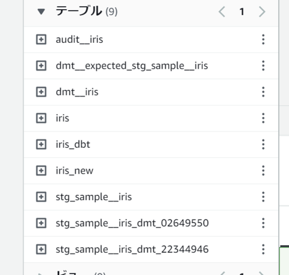

## 参考資料

- 公式
  - [【Snowflake×dbt】モデルで更新されたテーブル・ビューが完全一致しているかを検証するテスト](https://knowledge.insight-lab.co.jp/snowflake/-snowflakedbt-test-full-match)
    - dbtのtest機能を使用することで、SQLプロジェクトのテストを自動化できます。
    - HASH_AGGを使用すれば件数の多いテーブルでも、ものの数十秒で終わります。
    - dbtのテストはsingulartestとgenerictestの２種類があります。
    - HASH_AGGはSnowflake限定の話っぽ
- dbt-datamocktool
  - [スタブテストをdbtで行う「dbt-datamocktool」](https://zenn.dev/dbttokyo/articles/f4d5e3313655de)
- dbt-unit-testing
  - [dbt-unit-testing を使ってモデルのロジックテストを実装する](https://zenn.dev/lexiko/articles/dbt-unit-testing)
- Audit_helper
  - [Audit_helper in dbt: Bringing data auditing to a higher level | dbt Developer Blog](https://docs.getdbt.com/blog/audit-helper-for-migration)
  - [dbt-athenaでAudit_helperのテーブル監査支援機能を試してみた | DevelopersIO](https://dev.classmethod.jp/articles/dbt-audit_helper-try/)
- dbt_expectations
  - [Great Expectationsを用いたデータ品質テストがdbt上で行えるpackage「dbt_expectations」を試してみた #dbt | DevelopersIO](https://dev.classmethod.jp/articles/try-dbt-expectations/)
- 全般
  - [[dbt] データモデルの開発が便利になる「Package」を使ってみた（dbt_utils） | DevelopersIO](https://dev.classmethod.jp/articles/dbt-package-dbt-utils/)
  - [[レポート] dbtウェビナー『What is dbt？データ基盤にdbtが必要な３つの理由』を開催しました！ #dbt_classmethod | DevelopersIO](https://dev.classmethod.jp/articles/report-dbt-webinar-20230314-what-is-dbt/)

## 公式

dbt公式ページ

- [Add tests to your DAG | dbt Developer Hub](https://docs.getdbt.com/docs/build/tests)（公式）
  - singular test
    > 最もシンプルな形のテストで、失敗した行を返す SQL クエリを書くことができれば、そのクエリを tests/配下に.sql ファイルに保存することができます。
    - つまり、「この条件のクエリは0件でなければならない」という方法で検証し、1件以上であればNGとするテストらしい。
  - generic test
    > 引数を受け付けるパラメータ化されたクエリによるテストです。テストクエリは、特別なテストブロック（マクロのようなもの）で定義されます。一度定義すると、.ymlファイル全体でジェネリックテストの名前を参照することができ、モデル、カラム、ソース、スナップショット、シードに定義することができます。
    - Generic testsは、「独自のスキーマテスト」を定義するようなイメージっぽい？
    - なお、定義済みのスキーマテストは以下の4種類
      > - `unique`: the `order_id` column in the `orders` model should be unique
      > - `not_null`: the `order_id` column in the `orders` model should not contain null values
      > - `accepted_values`: the `status` column in the `orders` should be one of `'placed'`, `'shipped'`, `'completed'`, or `'returned'`
      > - `relationships`: each `customer_id` in the `orders` model exists as an `id` in the `customers` [table](https://docs.getdbt.com/terms/table) (also known as referential integrity)
    - つまり
      - unique: 一意テスト
      - not_null: 欠損値が無いことのテスト
      - accepted_values: ある指定値しか取らないことのテスト
      - relationships: 別テーブルのID（ex. customer_id） がcustomers テーブルの id として存在すること (参照整合性)
  - 公式機能で期待値一致をやる場合、EXISTSを使う必要があるのかも
    - https://classmethod.slack.com/archives/CJ10TUEQ6/p1695291608871509
      - 「[【Snowflake×dbt】モデルで更新されたテーブル・ビューが完全一致しているかを検証するテスト](https://knowledge.insight-lab.co.jp/snowflake/-snowflakedbt-test-full-match)」を真似て独自のテストを作る
      - EXISTSで包含関係を調べて一致することを確かめる

## パッケージ一覧

公式のschema.ymlを使う方法は割愛して記載

|状況|package名|GitHubスター数|dbt Hub|レポジトリ|
|:---|:---|:---|:---|:---|
|済|dbt-labs/audit_helper|236|[dbt Hub](https://hub.getdbt.com/dbt-labs/audit_helper/latest)|[GitHub](https://github.com/dbt-labs/dbt-audit-helper)|
|済|mjirv/dbt_datamocktool|148|[dbt Hub](https://hub.getdbt.com/mjirv/dbt_datamocktool/latest)|[GitHub](https://github.com/mjirv/dbt-datamocktool)|
||EqualExperts/dbt_unit_testing|317|[dbt Hub](https://hub.getdbt.com/EqualExperts/dbt_unit_testing/latest)|[GitHub](https://github.com/EqualExperts/dbt-unit-testing)|
||calogica/dbt_expectations|821|[dbt Hub](https://hub.getdbt.com/calogica/dbt_expectations/latest)|[GitHub](https://github.com/calogica/dbt-expectations)|
||yu-iskw/dbt_unittest| 16|[dbt Hub](https://hub.getdbt.com/yu-iskw/dbt_unittest/latest)|[GitHub](https://github.com/yu-iskw/dbt-unittest)|
||Divergent-Insights/dbt_dataquality| 18|[dbt Hub](https://hub.getdbt.com/Divergent-Insights/dbt_dataquality/latest)|[GitHub](https://github.com/Divergent-Insights/dbt-dataquality)|
||tnightengale/dbt_meta_testing|110|[dbt Hub](https://hub.getdbt.com/tnightengale/dbt_meta_testing/latest)|[GitHub](https://github.com/tnightengale/dbt-meta-testing)|
||dbt-coverage|152|なし(pipで導入するツール)|[GitHub](https://github.com/slidoapp/dbt-coverage)|


## dbt-labs/audit_helper

インストール方法は公式を参照ください。

- [dbt Hub](https://hub.getdbt.com/dbt-labs/audit_helper/latest)
- [GitHub](https://github.com/dbt-labs/dbt-audit-helper)

compare_queriesを検証した以下を見てみた。

- [dbt-athenaでAudit_helperのテーブル監査支援機能を試してみた | DevelopersIO](https://dev.classmethod.jp/articles/dbt-audit_helper-try/)

重複レコードはINTERSECTやEXCEPTでは、重複レコードは一つのレコードにまとめられてしまうため、想定と違っている様子。

PKになるもの、または一旦ソートして番号を降るなどをする必要がありそう。

その他のマクロは以下の通り

- [dbt-labs/dbt-audit-helper: Useful macros when performing data audits](https://github.com/dbt-labs/dbt-audit-helper)
  - compare_relations
  - compare_queries
  - compare_column_values
  - compare_relation_columns
  - compare_all_columns
  - compare_column_values_verbose

一旦これらは保留。

## mjirv/dbt_datamocktool

インストール方法は公式を参照ください。

- [dbt Hub](https://hub.getdbt.com/mjirv/dbt_datamocktool/latest)
- [GitHub](https://github.com/mjirv/dbt-datamocktool)

この中にあるintegration_testsがサンプルプロジェクトとなっている。

以下のように２箇所にそれっぽい記述があるが、GitHubのREADME的にはschema.yml側が普通と考えられる。

- integration_tests/tests/unit/staging/test_stg_customers.sql
- integration_tests/models/staging/schema.yml

以下、schema.ymlに記載する例。

```yaml
models:
  - name: stg_customers
    tests:
      - dbt_datamocktool.unit_test:
          input_mapping:
            source('jaffle_shop', 'raw_customers'): ref('dmt__raw_customers_1') # this is a seed
          expected_output: ref('dmt__expected_stg_customers_1') # this is also a seed
          compare_columns:
            - customer_id
            - first_name
            - last_name
```

input_mappingは入力の差し替えで、単純にsqlの置換を行っていると予想される。

expected_outputは期待値、compare_columnsは比較対象とするカラムである。

またコメントに書いてあるように、サンプルではseedを使っており、適当なcsvファイルを置いておくと`ref('csvファイル名')`で、seedを参照できる。

もっというと、以下のコマンドでseedに格納されているcsvファイルをAthenaテーブルに変換することができる。（型は推測している様子）

```shell
dbt seed
```

seedのテーブル化は型推測なので、実用的には以下を調べる必要がある

- seedのテーブル化時に型を指定する（やり方を調べるところから）
- seedを使わず別途手動で期待値用のテーブルを作成する

あとからの追記だが、以下を見たところseedをテーブル化する際には、modelと同様の形でデータ型を指定できる様子。

- [Seed properties | dbt Developer Hub](https://docs.getdbt.com/reference/seed-properties)

その後、dbt testを実行する。

```shell
dbt test

# 09:19:59  Running with dbt=1.6.6
# 09:20:00  Registered adapter: athena=1.6.3
# 09:20:00  Found 3 models, 2 seeds, 1 test, 1 source, 0 exposures, 0 metrics, 530 macros, 0 groups, 0 semantic models
# 09:20:00  
# 09:20:02  Concurrency: 1 threads (target='dev')
# 09:20:02  
# 09:20:02  1 of 1 START test dbt_datamocktool_unit_test_stg_sample__iris_sepallengthcm__ref_dmt__expected_stg_sample__iris___ref_dmt__i
# ris_  [RUN]
# 09:20:14  1 of 1 PASS dbt_datamocktool_unit_test_stg_sample__iris_sepallengthcm__ref_dmt__expected_stg_sample__iris___ref_dmt__iris_  
# [PASS in 11.44s]
# 09:20:14  
# 09:20:14  Finished running 1 test in 0 hours 0 minutes and 13.82 seconds (13.82s).
# 09:20:14  
# 09:20:14  Completed successfully
# 09:20:14
# 09:20:14  Done. PASS=1 WARN=0 ERROR=0 SKIP=0 TOTAL=1
```

testで作成されたテーブルは以下のようにsuffixが自動で付与される。

- stg_sample__iris_dmt_02649550
- stg_sample__iris_dmt_22344946



テスト方法としてはaudit helperと同様に、INTERSECTとEXCEPTを使用しているため、「差集合が空集合である」ことのテストとなっている。（PKがある場合は問題にならない）

これで不十分である場合は、マートの要件に応じて以下のような別途追加のテストを書く必要がある

- 期待値とテスト対象の、件数を比較
- 期待値とテスト対象の、各レコードごとの重複数をカウントして比較

audit helperと比較して、schema.ymlに記載でき、別途クエリを書くよりは筋が良い印象。（dbt runではなくdbt testでテストできるのもよい）

## EqualExperts/dbt-unit-testing

インストール方法は公式を参照ください。

- [dbt Hub](https://hub.getdbt.com/EqualExperts/dbt_unit_testing/latest)
- [GitHub](https://github.com/EqualExperts/dbt-unit-testing)

使用開始前に`macro/macro.sql`にまず以下を追加する。

```sql

   {{ return(dbt_unit_testing.ref(model_name)) }}



   {{ return(dbt_unit_testing.source(source, model_name)) }}

```

これは既存のmodelのsqlファイルの記述を変更しないために必要となる。

（これを書かない場合は`ref`を`dbt_unit_testing.ref`にすべて書き換えないとtestを動かすことができない）

次に以下のようなテストコードを`tests/`配下などに作成する。

```sql
{{
    config(
        tags=['unit-test']
    )
}}



  
    select '1' as id, '5.1' as sepallengthcm, '3.5' as sepalwidthcm, '1.4' as petallengthcm, '0.2' as petalwidthcm, 'Iris-setosa' as species
  

  
    select '1' as id, '5.1' as sepallengthcm, '3.5' as sepalwidthcm, '1.4' as petallengthcm, '0.2' as petalwidthcm, 'Iris-setosa' as species
  

```

以下説明

- 先頭のtagsは固定で必要。
- `dbt_unit_testing.test`はテスト対象と説明
- `dbt_unit_testing.mock_source`はソースを入力としている場合のモック
- `dbt_unit_testing.mock_ref`はmodelを入力としている場合のモック
- `dbt_unit_testing.expect`は期待値

なお、後から確認したが、expectの中のクエリは以下のようにテーブルを参照することもできる。

```sql
  
    select * from {{ source('cm_nakamura','iris') }}
  
```

なのであらかじめseedから期待値テーブルやモック入力をテーブル上に作成しておく、などの運用も可能。


実行は以下のいずれか（前者はその他のテスト含めてまとめてテストが動作する）

```shell
dbt test
```

```shell
dbt test --select tag:unit-test
```

期待値一致の方法としては、audit helperやdatamocktoolと異なり重複ありでも一致を考慮した評価が成される。

Athenaに流れるクエリの大まかな説明は以下。

- 各カラムでgroup byされレコード数がカウントされる（重複レコード数が値毎に作成される）
- 上記を期待値と実際の値で比較し一致することを確認

また上記を実施するにあたって一時テーブルは作成されないため、テストの度にテーブルが作成されることは意識する必要がない。

モックデータの記述方法はsql意外にもcsvフォーマットなど別の記法で記述することが可能。

`dbt_project.yml`に以下のように記載けば、

```yml
vars:
  unit_tests_config:
    input_format: "csv"
    column_separator: "|"
    line_separator: "\n"
    type_separator: "::"
```

以下のようなモックデータの記述が可能

```sql
-- ...
  
    customer_id | first_name | last_name
    1           | ''         | ''
  
-- ...
```

総じて、きちんとした期待値一致と一時テーブルの作成が行われないため、audio helperやdatamocktoolと比較して良い印象。

incremental modelについては未調査。

## calogica/dbt_expectations

dbtデフォルトのスキーマテストの強化版という印象。

ベースとなるGreate Expectationsでは期待値一致もとれるはずだが、このdbtのパッケージでは使用できない様子。

詳しくは貞松さんが調べて下さっている。

## yu-iskw/dbt_unittest

## Divergent-Insights/dbt_dataquality


## tnightengale/dbt_meta_testing

## slidoapp/dbt-coverage

