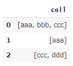
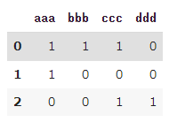

# sklearn

## pipeline

- sklearnのpipelineに自分で定義した関数を流し込む - Qiita
  - https://qiita.com/kazetof/items/fcfabfc3d737a8ff8668

## data

- train_test_splitのindex番号を記憶する方法
  - 引数`indices`にindex番号を指定すればOK

```python
X_train, X_test, Y_train, Y_test, indices_train, indices_test = train_test_split(X, Y, indices, test_size=0.33)
```

- 参考
  - https://qiita.com/haru1977/items/7aaf1eaeb0747fe613be

## マルチラベルをバイナリエンコード

category encodersで対応できないので、scikit-learniでやる必要がある。

一つのセルに対して複数データがセットある状態が入力。

```python
import pandas as pd
df = pd.DataFrame(
    {"col1": [["aaa","bbb","ccc"], ["aaa"],["ccc","ddd"]]}
)
df
```


これを以下のコードでバイナリエンコード可能

```python
from sklearn.preprocessing import MultiLabelBinarizer
mlb = MultiLabelBinarizer()
df = pd.DataFrame(mlb.fit_transform(df['col1']), columns=mlb.classes_)
df
```


- 参考記事
  - [Types of Encoder - Michael Fuchs Python](https://michael-fuchs-python.netlify.app/2019/06/16/types-of-encoder/#multilabelbinarizer)
  - [pandas.DataFrameのマルチラベルを簡単にバイナライズする方法 - Qiita](https://qiita.com/maechanneler/items/b6a06a9e296f02af0801)

## StratifiedKFold

cross-validationで層分割する際に使用。戻ってくるのはindexのみ。

DataFrameを使う場合、このindexはpandasのindexではないので注意が必要。なので`iloc`でアクセスしないとハマる。

```python
skf = StratifiedKFold(cv_split_num, random_state=42)

for train_index, valid_index in skf(feature_df, target_df):
    X_train = feature_df.iloc[train_index]
    y_train = target_df.iloc[train_index]
    X_valid = feature_df.iloc[valid_index]
    y_valid = target_df.iloc[valid_index]

    # ...
```

- 参考記事
  - [Python: pandas の DataFrame を scikit-learn で KFold するときの注意点 - CUBE SUGAR CONTAINER](https://blog.amedama.jp/entry/2018/06/21/235951)