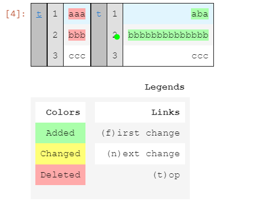

# difflib

## HtmlDiffで差分を色付け表示

```python
from difflib import HtmlDiff
from IPython.display import HTML

str1 = "aaa\nbbb\nccc\n"
str2 = "aba\nbbbbbbbbbbbbbb\nccc\n"

HTML(HtmlDiff().make_file(str1.split(), str2.split()))
```



* make_fileに与える引数はリスト型で指定される。
* なので、文字列以外の配列なども比較は可能。

## 参考

- [difflibで文字列の差分比較をする【Python】 | YukiPress](https://mat0401.info/blog/basic-python-difflib/)
